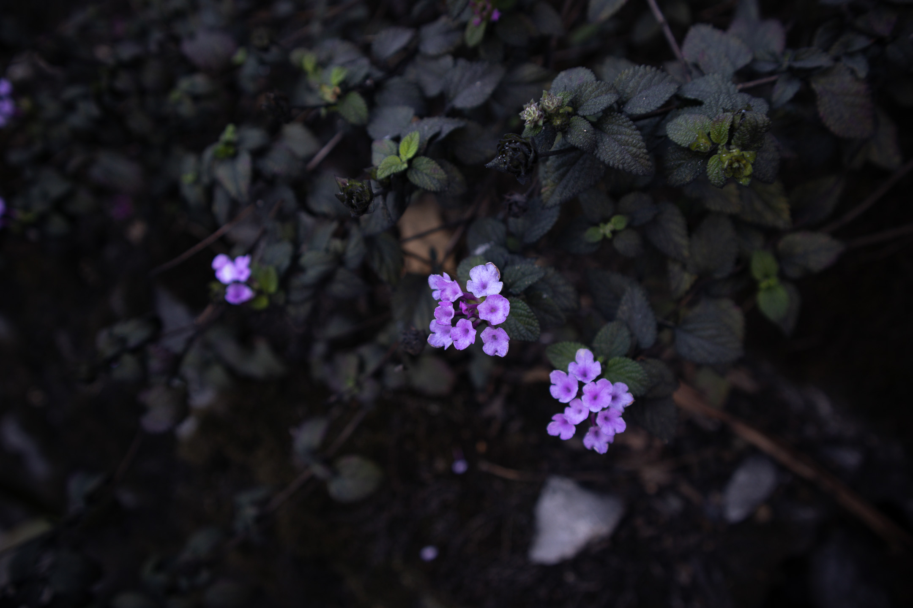
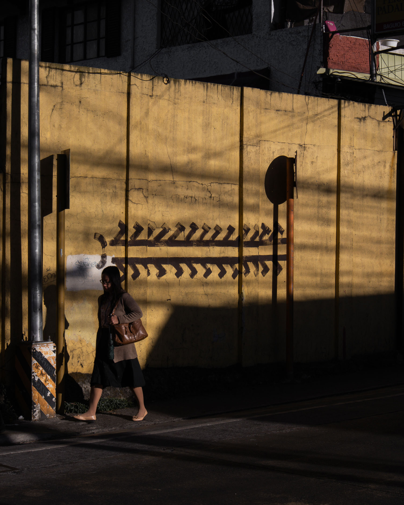
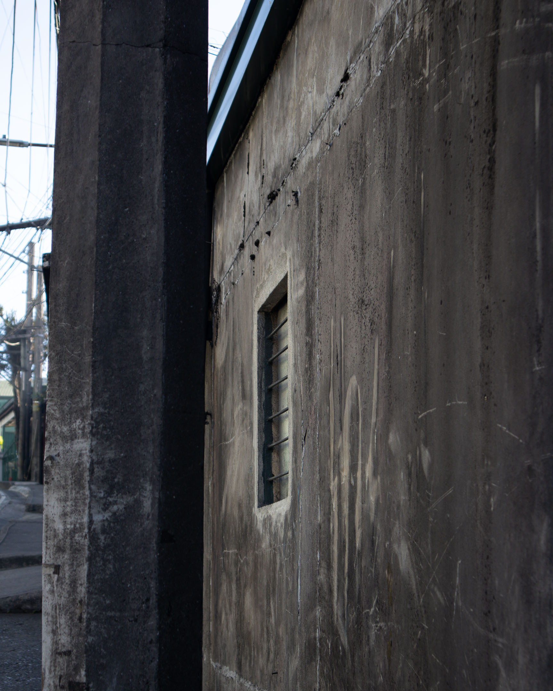
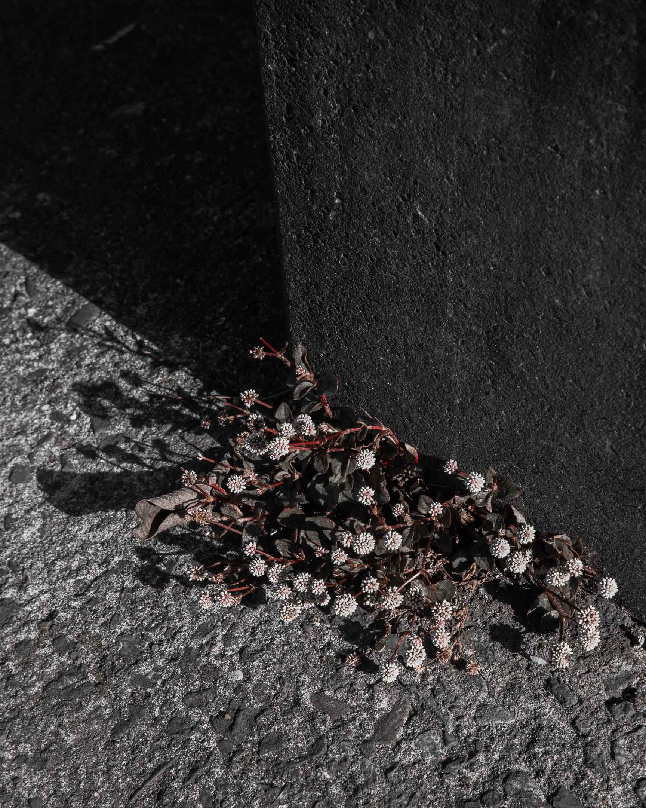
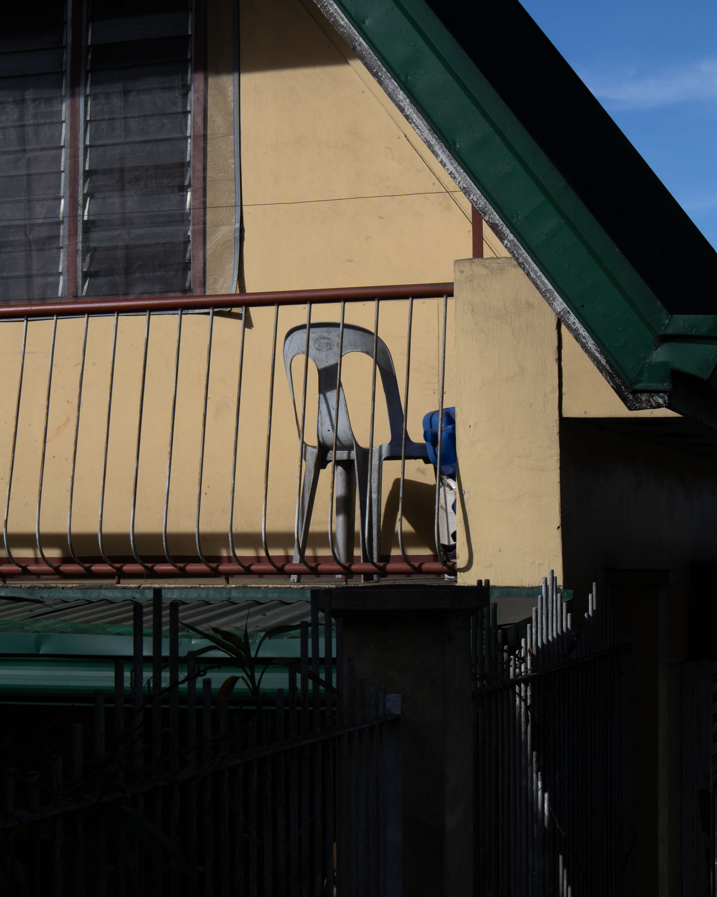
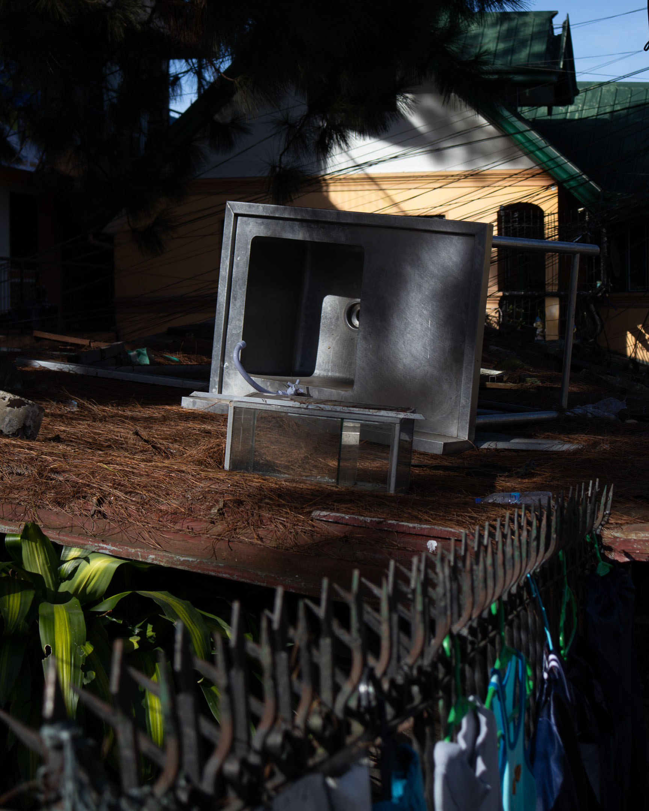
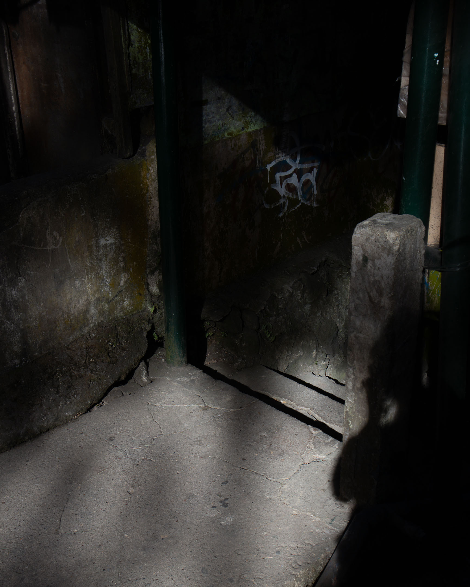
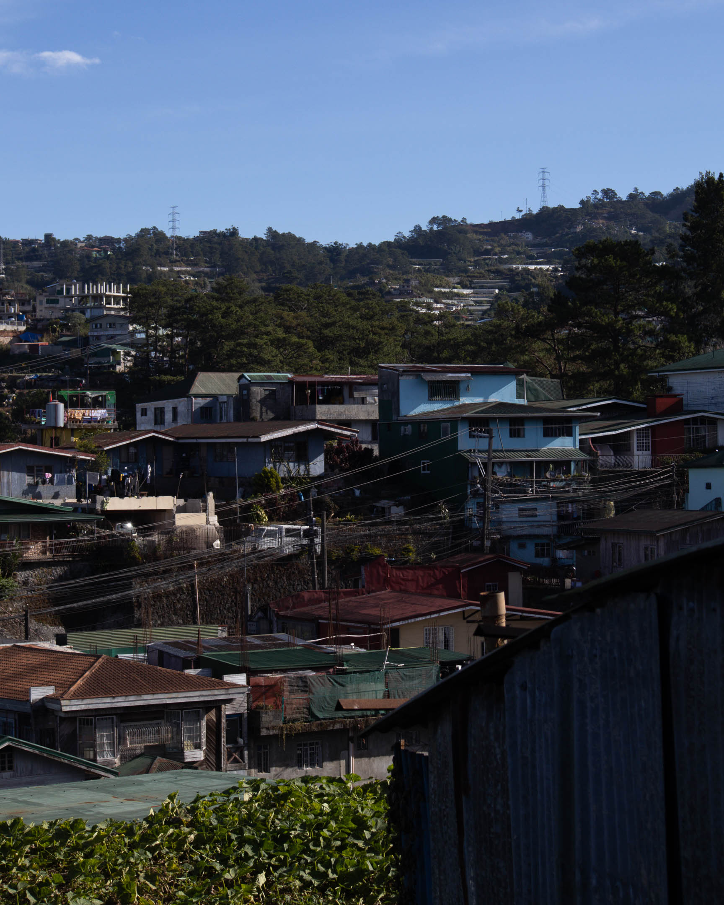
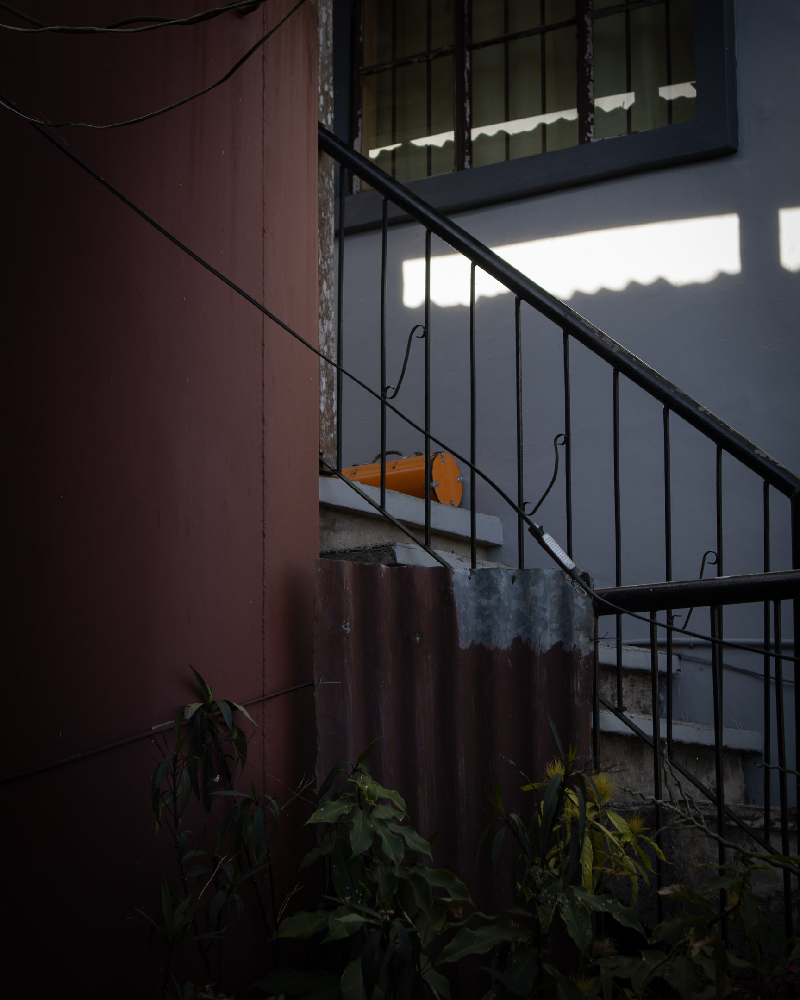

I wonder how many times we've walked this street together. Now that I think about it, I believe we've never walked all of it. Perhaps a few steps here and there. But never the entire length of it.

This morning, I walked the walk we never had.
***
I'm looking for their houses. If I never left (if I never left you), I would've immediately found them. All I can remember is that both houses are along this road.

Ruins of a house that once stood here show on the corners of this vacant lot. I have a hunch that this is one of the houses. I'm baffled at how surprised I am. It is as if I left just yesterday. I had to remind myself that all these images were from twelve years ago.

***
An old man sitting outside a door held the hand of what seems to be his grandson as the child was about to enter the house. He pulls the boy toward him and kisses his cheek. He does this repeatedly as he shouts the name of the boy. Neighbors stopped whatever they were doing to watch this public display of affection. The child has down syndrome. With every kiss the grandfather gives, the neighbors see how much the child is loved.

***
This is the route I took the morning after we told each other this couldn't go on. It was a Monday morning. The night before, we both slept over at the couple's house after a long day in the ministry. We were invited along with one or two other friends. We had dinner, laughed together, pretended nothing was happening underneath it all. But when we exchanged gazes, I can't help but notice your eyes were trying to tell me something I'm still trying to decipher today.

At midnight when everyone was asleep, I sent you a text message telling you to meet me at the living room. I moved slowly out of bed and closed the door carefully as to not wake up our friend. Perhaps, you did the same.
***
You told me your father already knew about us. You told me he advised you to cut things off. He told you to say to me it was unwise to promise love to a sister when I intend to enter missionary training, which requires trainees to be single. I was just 18 and wasn't anywhere near the requirements to enter missionary training. To be qualified, I need around five more years, give or take. That would be a reasonable waiting time. Some brothers waited ten years before being accepted.

I told you I've also talked to my father about us, and he said the same, albeit a bit more unkindly. We both agreed it must end. That midnight, we went back to our separate rooms without saying goodbye.

***
We knew that in the following days, we would continue to see each other at the kingdom hall and work together in the field ministry. These we would do while we begin the long, painful process of killing this thing that naturally blossomed between us. The anxiety of how the next days would unfold kept me up most of that night.

In the kingdom hall, we were taught how to read the bible, interpret it, use its verses masterfully to devise bulletproof arguments defending our faith. What they never taught us was how to hold our hearts with utmost care like our lives depended on it.

***
It was a walk I have almost no memory of. A thought-less walk. An image-less walk. A walk I'm doing as if for the first time. These are houses I don't remember. These are unfamiliar walls. These are turns I may or may not have ever made.

Is this the pavement I walked on as I tried to find my way back home, unaware that it would be my last walk in the realm of sanity?

***
As I pass by Bayan Park,  
the leaves of a lone bamboo  
greet me with the wind.  
***
Did I ever tell you that the following morning after that walk I'm trying to replicate today (perhaps unsuccessfully), I took another walk, an early one inside this park?

Before that morning, I've never went up this hill. Before that morning, this park was just a lump of soil I glanced upon before riding the jeep that would take me to town.

That morning, I remember waking up feeling so sad. I wasn't worried about it. I told myself it was only natural to feel sad about how things ended between us.

That sadness remained unchanged until Friday, when we met again at the meeting. After arriving home, I texted you, I'm still feeling down and you told me you were feeling the same. I still wasn't worried.

When that sadness extended for another week, coupled with an inability to sleep and a tiredness that made my eyeballs sweat, I began to worry—that was when I knew something was wrong with me.

***
Did I ever bring you here? Did you ever see this hole where I slept after spending all those hours with you in the field?

I like to think I did. Although when and how and what happened, I couldn't remember.

Kept inside this hole I deepened my adoration of our God. Kept inside this hole I deepened my adoration of you.

It was in here where I created the maps of the places we walked together in the city and beyond. It was behind this door where I typed every single one of those records—names, addresses, educational attainment, notes from ministers who've visited (including yours)—of every person who is deaf or hard of hearing in the city and neighboring towns. These are records of our work together. These are archives of our love.
***
In the evenings, this is the stairs I used to sit on as I talked with you for hours (I had to get out of the house so my sister won't hear our murmurs). It must've been so cold during those nights—as cold as it is today. It was during those calls when I first saw the lights on the hills of Ambiong. I would later learn that those lights came from flower farms. To grow better (and faster?), some flowers needed a longer day, which is accomplished by night-interrupting lights.

In that short period from 2010 to 2011, I desired the opposite. I needed longer nights, so I could have more of your voice.

***
These words and images come to me after the walk.

While in the walk, I was "in" the walk. Almost no words and images arrive as I revisit the route I took that day. My feet brings me back to where I am now and pulls me to the only place that is true.

But my mind doesn't forget. I still remember you—your face, your voice—as I sit and look at these photographs.

I wouldn't dare ask the question (what could've been?). I wouldn't dare.

But twelve years is like a lifetime. And we are now living our second lives. The only way forward is to be *here*.

Since the mind remembers but the feet forgets, I shall walk and walk and walk, until everything that took place before is but a flickering light over the silhouette of a hill, until everything is but a murmur floating on a staircase at night.

