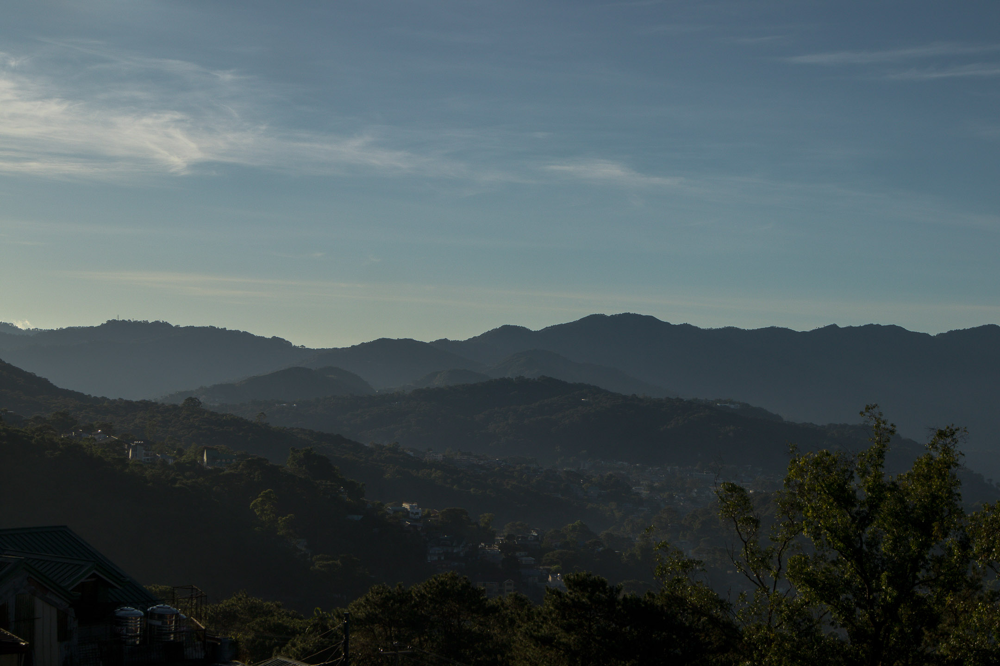
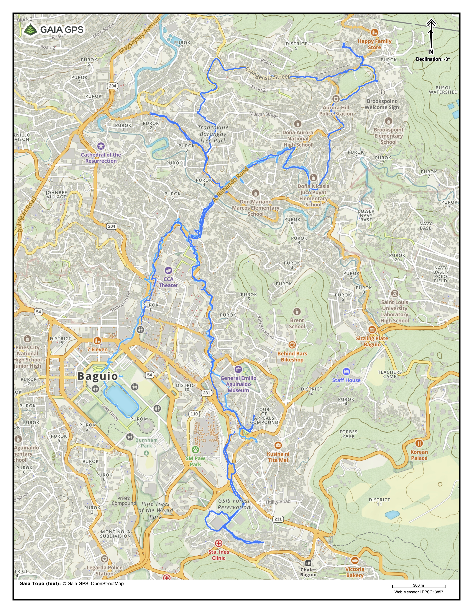
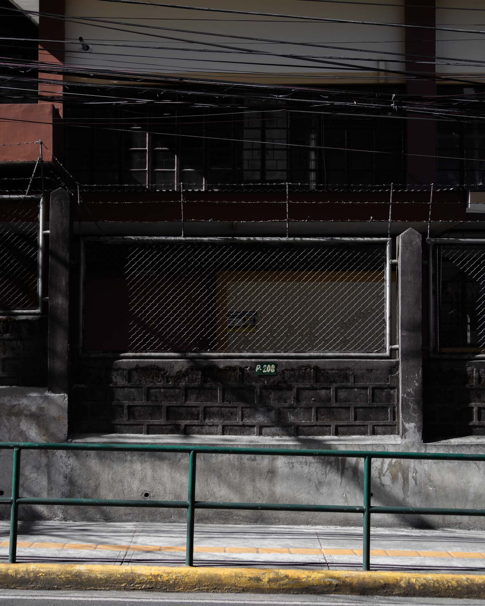

I wanted to walk, photograph, and write until January 21—to send at least four missives. But after writing and sending yesterday's essay, I felt strongly that it must be the essay that ends this first attempt to re-walk Baguio City.

Truth be told, I could've lumped all three walks into a single walk since they all shared a similar route, namely Upper Bonifacio Street, Lower Bonifacio Street, and Rimando Road. If I were walking these routes in the context of the "Roots x Gravel" (week-long walk of Los Baños) that I did last December, I could've finished walking all of them in one day. But walking around Baguio is different. The meanings attached to almost every corner of that city are too much to be revisited in a single day.

I've lived in Los Baños for three years already—the same number of years I lived in Baguio City as a JW minister. And yet, I wouldn't say I have attached as much meaning to Los Baños as I had in Baguio. There was just too much activity happening in my young life from 2008 to 2011, too much passion for religion, that I'm realizing just now how much occurred throughout those years.

Therefore, walking Baguio demands this slow, careful, and mindful stride that balances a desire to remember with an intention to protect oneself by being present in place and moment as much as possible.

I noticed that walking did help me be present in the places I visited. Of course, I constantly reminded myself to be *there*—to return to place the same way I return to my breath during meditation and to see these places primarily as new ones, not reservoirs of past narratives. Surprisingly, memories did come, but in minimal amounts, during the walks. Most of the memories I included in my missives came when I was already writing about the places "after" the walks.

Since walking in Baguio last October 2023 flooded me with memories, what was different in these walks? I think it was my intention to be present in place as much as possible, which prevented the memories from flooding me in the middle of the walks this time. Of course, mindful walking also helped put me back in the present moment.

## The Walks

Since presence and remembering were the priorities of this walk, I decided not to share the number of steps and kilometers covered by these three walks in my daily missives. But for those who want to put more perspective on the effort needed to perform these walks, here are the numbers:

- Day 1: 15,851 steps; 5.75 km
- Day 2: 10,858 steps; 6.61 km
- Day 4: 13,577 steps; 6.27 km

These walks happened on around 23 streets in Baguio, covering around 14 barangays. The map of the entire walk is shown below. This map is a visual representation of the routes most covered by my feet in my three years of serving here as a JW minister for people who are deaf and hard of hearing.

## What's Next

I'm currently in Pangasinan to spend about a week with my parents. Pangasinan is just two hours away from Baguio, so I often stay here before or after visiting the mountain city.

I'll return to Los Baños after a week, where I might switch to other non-walk-related matters, including freelance work (!) because I need to eat and save money to fund future walks. That said, returning to the walking Los Baños project is definitely part of the months ahead. I want to return to my writings, see what else I can do, and hopefully begin a book project. After doing the Baguio walk, I think I now know better how to frame the book about walking Los Baños. To move this project forward, I'll do at least another week-long walk of Los Baños, which would include sending a photography-only email newsletter to any of you interested.

As for Baguio, I would like to continue walking the city, of course. But after this trial walk, I'm thinking about doing a few necessary tweaks:

1. **Walk Baguio in less cold months (around March to May).** I underestimated the cold, making my stay in the city a bit uncomfortable. Heating wasn't available in my sister's house, so working and sleeping in the evening was challenging. I was used to the cold when I lived here 12 years ago. Now, my body has forgotten it (among other things I've forgotten about this city), so I need to be mindful of getting warm next time.
2. **Stay in a place where I can have more solitude.** I stayed with my sister and her family to save money (these trips aren't cheap, which is also a critique of the walking methodology!). Although I enjoyed being with my nephew and nieces longer (and that, I think, helped me process and take a rest from the thoughts and emotions I was writing about), it wasn't easy to write in the afternoon and early hours of the evening when the children returned from school. I tried to make the most of it but wrote most missives past 9 pm when the children were asleep. Next time, I should arrange to stay with a friend (with no kids!) or rent a place for a few days to concentrate better when writing the missives after the walks.
3. **Begin exploring non-JW walks.** Returning to my past through walking Baguio is the central theme of these walks, and I'm not yet done exploring this theme. For example, one possible sub-theme of future Baguio walks could involve returning to the "deaf routes" I used to walk to visit bible students who were deaf or hard of hearing. (Who knows, I might even reunite with some of these students?) That said, I noticed while doing the third walk that there are still many places in Baguio with no JW-related memories attached to them. These places, I think, are critical to the adjacent project of "reimagining" Baguio after leaving the JWs.

## Thank You

Before I shut the doors for this walk, I would like to use this moment to express my gratitude to you properly. The subject of this walk is too niche (who cares about JWs?) that I'm surprised a handful of you even read my emails. I would still do these walks and write these missives even if no one reads them because I am doing them for myself first. I need to do them for my sanity. To have someone read them is already a bonus. But a bonus that helps me process the past and face the future better.

Since I started writing about my personal history with the JWs, friends and readers began reaching out to me, telling me their stories of "conversions" within a particular religious tradition or from one religious tradition to another. Almost everyone who trusted me with their stories told me of the "pain" inherent in such detachment processes and the "necessity" that such separation demanded.

I, myself, am still in the process of truly understanding how these processes of detachment happen (thus, these walks). Because of this, I don't have all the answers. In fact, I have very few of them! But all I know is that committing a portion of my time and skills to address this specific human experience opens up a portal for at least a few of us to understand better, on a personal level, the larger cracks and wounds we see in the fabric of society that arose because of the tension between the human desire to be authentic and the human difficulty to tolerate that which is different.

I'm doing my best. I know and trust that we all do. So, thank you for being here, walking with me, and trusting the path.

If you need anything, please don't hesitate to reach out.

Until the next walk,

Vince

