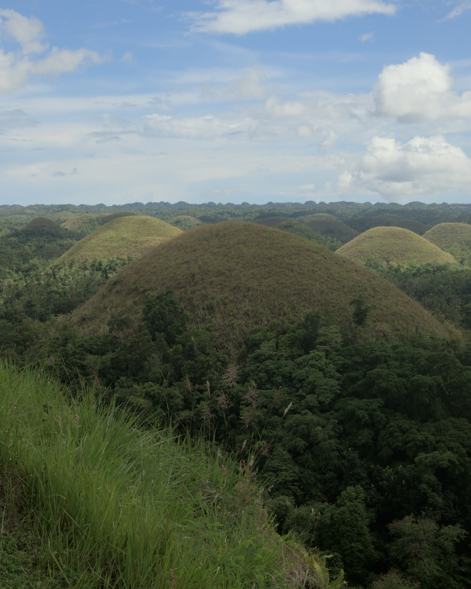

[Uman](uman) means “change.” It is a monthly newsletter I send every first week of the month, documenting what it means to pursue philosophy, contemplation, and writing independently as a way of life. It used to be a separate newsletter. But I've integrated it into [The Long Walk](tlw). Read the past issue [here](uman/010).
***

## Faith and Contentment

The timer I use during meditation checks up on my mood before every practice. It does so by offering several choices. I never clicked the word "content." I reason that I'm in the middle of fixing a lot of things in my life, so how can I be contented?

But then I encountered the following excerpt from the essay "Presence, Memory, and Faith" by Steven E. Webb from *Wilderness and the Heart*, a book about [[henry bugbee|Henry Bugbee's]] philosophy.

>Fishing stands for the life of faith, and the leaping fish stands for those exclamatory experiences—perceptual, mnemonic, or both—that may supervene upon that life. Apart from our active commitment to what the river may bestow, we would never cast our lines and the fish would never leap. This does not mean that the fish must leap. We can't control their presence, and if we seek for control we shall reduce our lives to continual frustration. Faith, like fishing, has the somewhat oxymoronic character of active waiting—of *keeping* oneself open to whatever may come. Thus wanting a saving experience at the end of one's days not only indicates an unwholesome fixation on something one can't finally possess, but is quite beside the point. The issue is not the availability or durability of such experiences as isolated moments, but rather what they confirm, if and when they do occur, about the "omnirelevant truth"—affirmed and kept in faith—that our world *is* a holy place, that things *are* worthy of love, and that our life together with them *is* affirmable even in our moments of obscurity, and even as we perish.

Reflecting on these words while walking one night at Ela Ave. in September, I realized that I could find contentment in every moment regardless of the situation and despite things being not okay. I could do this through faith, a word I've avoided ever since [[a never-ending walk|leaving my childhood religion]], but now I'm exploring and reintegrating into my life through my interpretation.

## Dream Log

In response to my reading of [[a religion of ones own by moore|A Religion of One's Own by Thomas Moore]], I started a [[dream log|dream log]]. I am still trying to figure out what good this practice will bring me, but I'm doing it out of curiosity. I noticed that starting a dream log seems to make me have more dreams and remember them. I haven't caught all my dreams yet, and I might be slowly shedding this practice, but oh well. I am just trying.

## Mind Walks

My favorite thought note this month is: [[art is never finished|Art is never finished]]. I wrote this while working on an essay I later sent to a literary journal. It talks about this modern bias to complete a work of art and why this could be going against the very nature of art.

The best quote I encountered in September is from Andrew Anabi:

>When life changes, you will probably miss the way it was. You may miss those long morning drives or walks to the office, or those hectic family gatherings. You may miss them because those moments are finite—you will only travel those streets and see those people a certain amount of times.
>
>Every time you do something that is one less time you do it. One day you will do something the final time and you will rarely know when that day comes.
>
>For all you know, today might be the last time you walk in a particular neighborhood. Or it might be the last time you smile at a particular someone. To think otherwise, would be foolish. Nothing is guaranteed, except this moment. Your only real choice is to cherish every exchange like it is your last -- because it very well might be.
>
>Therefore, the best way to cherish life is to remind yourself of life's impermanence. It is to remember that every time you see someone that is one less time you see them. It is to remember that every time you go somewhere that is one less time you visit. By doing this, you naturally slow down. Almost like a reflex, you start to truly live.

The best things I read this month were:
- [[lynda barry kios|Lynda Barry Will Make You Believe in Yourself by Dan Kios]]
- [[nightingalingale mod|The Nightingalingale Newsletter by Craig Mod]]

## Newsletters

I published three newsletters in September:

- [[this morning|This Morning]]
- [[the possibility of love|The Possibility of Love]]
- [[sabel|Sabel]]

## Writing Events Applications

Last August, I wrote [[mulimuli pangasiniani|a lyric essay]] in Pangasinan and its [[perturbations on pangasiniani|English translation]] and sent it for my application to the Cordillera Creative Writing Workshop (CCWW). The rejection of my application got me thinking a lot about how I'm approaching these applications and my writing life. I'll write a more detailed essay about this, but here's my new personal guiding principle when sending entries to workshops, fellowships, and contests.

Since the acceptance rate to these writing events is pretty low (which means I was just fortunate to get in [[anww20|ANWW20]]!), the healthiest attitude when applying is to expect rejection. Then, use the application process to these events to force you to do your work. Remember that this is the assumption of most of these events anyway—that you are bringing a work in progress. So do that.

Whether you get in or not (highly likely you won't), you were able to move a personal project. Everything should be about your personal projects. Articulate what your art stands for, focus on creating a portfolio around that stand, and never rely on others to tell you you're good or publishable. Stick to your gut feeling and use contests, workshops, and fellowships to serve your vision, not the other way around.

I used this newfound perspective in approaching the submission process to the Gawad Bienvenido Lumbera (GBL), a literary contest that recently ended its acceptance period.

I sent a collection of my best 12 poems in Pangasinan. I began the project with the assumption that I would lose. Then, I used the application processes to force me to do work and teach myself writing. For this contest, it was about learning poetry, particularly revising it. To prepare for my entry, I chose the best Pangasinan anlong (poems) in my [[my forest garden of the mind|Talahardin]]. I started with seven, the minimum number set by the contest guidelines, but later added five more when I accidentally discovered the collection theme. I called the collection Kasabi Kaagwan or When Noon Comes, thus the number 12. After selecting the poems, I created a [[poem revision process|poem revision process]] based on [[billy collins masterclass|Billy Collins' Masterclass]] and used it to improve each poem in the collection.

Like I said, I am pretty sure I won't win any awards, but I have 12 poems that are now way better than when I first wrote them (way, way better!). Plus, my revision skills are now sharper. These two rewards for me are enough.

September was jam-packed with writing projects. Aside from the GBL and writing revisions for a client, I also worked on an essay that forced me to articulate my entire writing system and practice for the first time. It was a fun essay that braids walking and my note-writing system and their implications for literature in general. Again, I expect to be rejected... but writing that essay has convinced me I might be able to teach my writing system to others soon. If the article gets accepted, you'll be the first to know.

## Bohol

Around the middle of the month, my partner and I visited Bohol. To be honest, I find it difficult for me to write about Bohol. Among all the provinces I've seen in the Philippines, this was the most commercialized, and I felt distrustful of people the whole time. That said, the trip helped me get back to photography, a practice I haven't been able to nurture in the past months. I still seek the right angle and story to share about the Bohol trip. For now, I'll let some photos tell their story.

