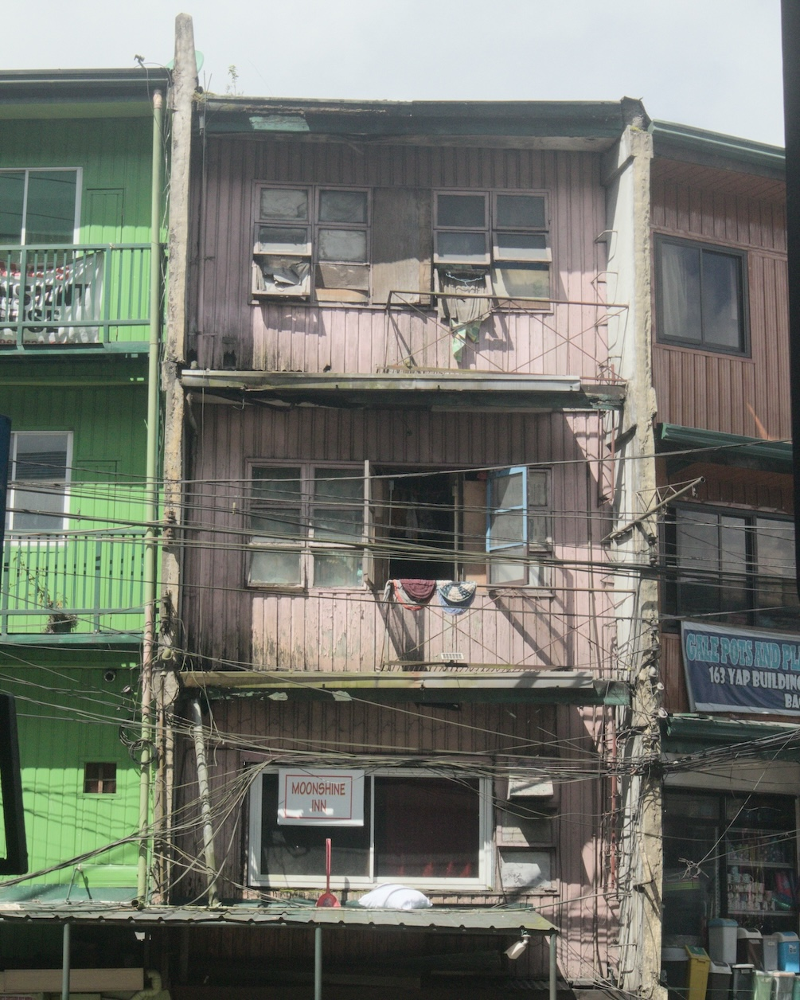
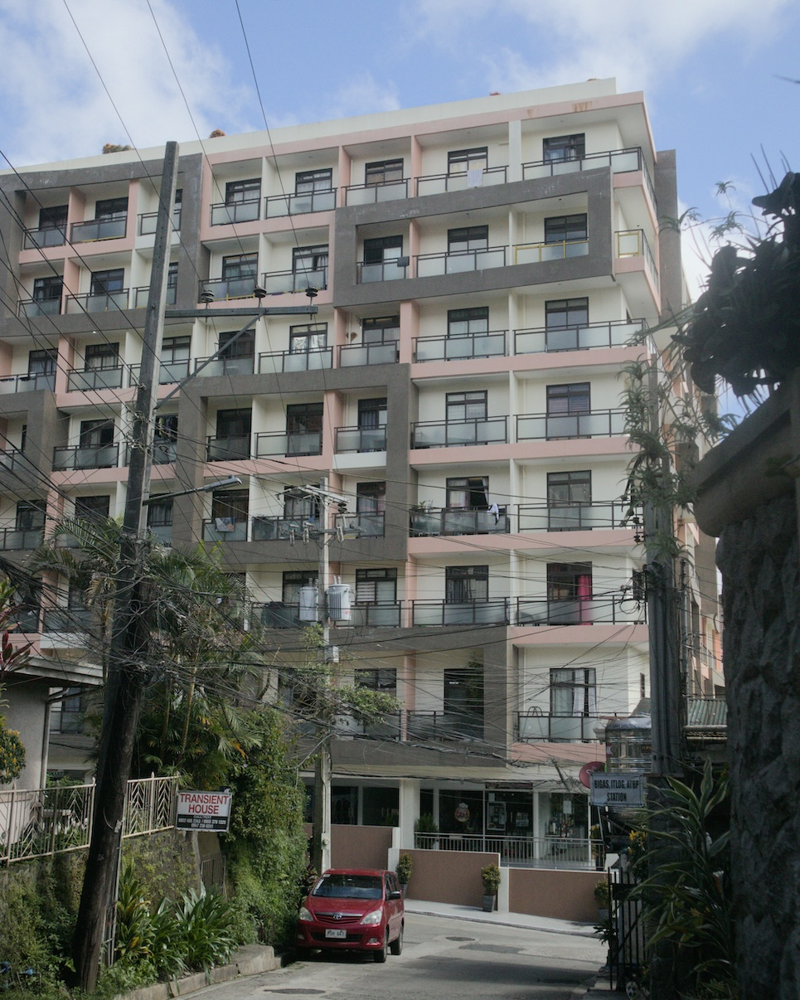
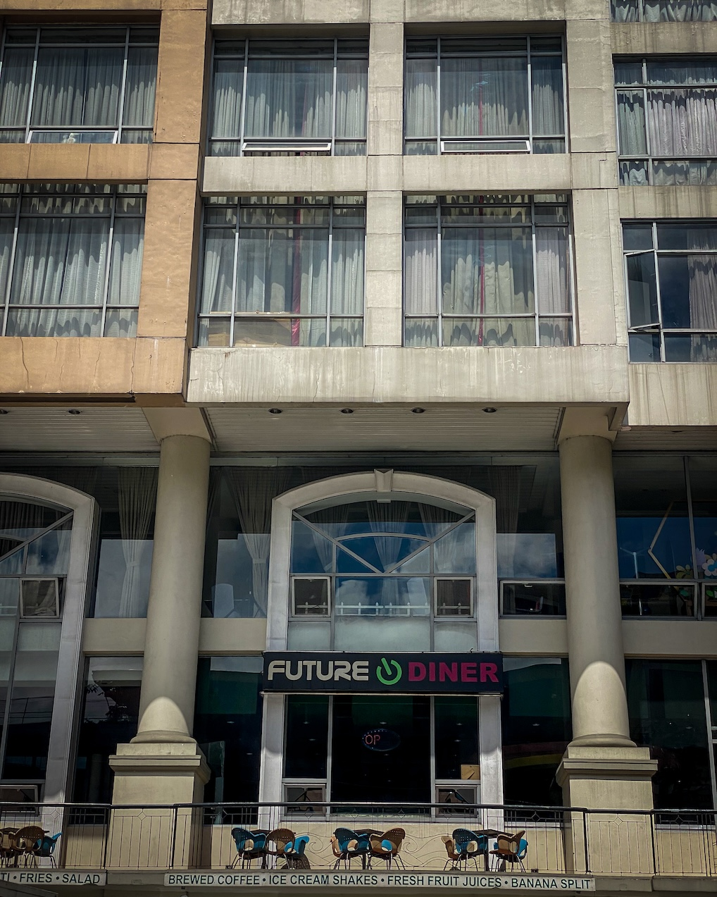
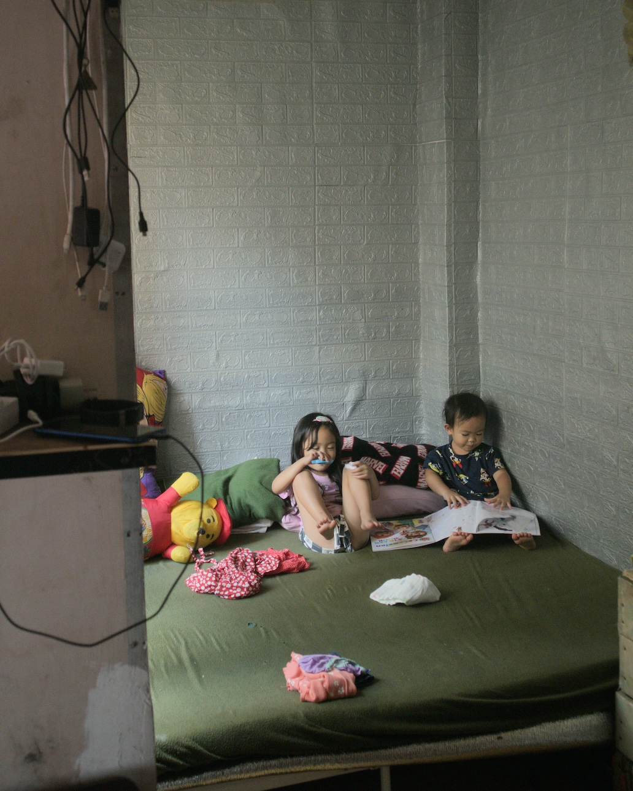

[Uman](uman) means “change.” It is a monthly newsletter I send every first week of the month, documenting what it means to pursue philosophy, contemplation, and writing independently as a way of life. It used to be a separate newsletter. But I've integrated it into [The Long Walk](tlw). Read the archives [here](uman).
***

Entering October, I expected it to be a quiet month. I had a single writing project that was not urgent, I had a couple of client works, and I was set to travel to visit my family.

I should've known by now that it is when life is quiet, when the ghosts of past lives come to visit us.

## Epistolary Essays on Walking

I mentioned last [[uman 2023-08|August]] that [[jesa suganob|Jesa Suganob]] and I are collaborating on a writing project exploring [[04 notes/walking]] through epistolary essays. On October, we finished revising all our essays and sent them to each other. We've began exchanging impressions about each other's work and are currently discussing how best to move the project forward. I can't wait where this collaboration will take us. Wherever it goes, you'll be the first to know.

If you're curious to see what an epistolary essay on walking looks like, here's an example: [[2023-09-02 letter to j|2023-09-02 letter to J]].

## TLW

I published two issues of The Long Walk last October 2023. In case you missed them, here they are:
- [[a midsummer rain in lb|A Midsummer Rain in LB]] (poem)
- [[approach life with humor|Approach life with humor]] (note)

## Photography via Darktable

Inspired by the solar punk artists behind [Hundred Rabbits](https://100r.co/site/home.html) I'm starting to veer away from expensive subscription-based photography software like Lightroom and Photoshop in lieu of free and open-source software like [Darktable](https://www.darktable.org/). It's surprisingly easy to use and arguably even more powerful than Lightroom. The photos from my recent trip to Bohol, which I shared on Instagram and [[uman 2023-09|last month's issue of Uman]], were edited in Darktable.

## Walking Baguio

I went back home to Pangasinan. I try to visit my family (that includes my dogs) every four months for around a couple of weeks. On this return, I also visited my sister and her kids in Baguio.

On October 15, a Sunday, I spent the morning walking from Engineer's Hill to Magsaysay Ave. in search of a Middle-Eastern restaurant. Alas I came too early; the beef won't be ready until lunch time. To kill time, I continued walking to the Bell Church that demarcates the border between Baguio City and La Trinidad.

While walking towards the Taoist temple carelessly called a "Church," I passed by a restaurant that held memories. I have never been in this restaurant but my friends in the church and I used to kid about this particular place. It was one of the fanciest restaurants in Baguio ten years ago (perhaps it still is?) and we joked that one day we would treat each other there—one day, we would always say. For this very reason, we find the name of the restaurant particularly appropriate: "Future Diner."

I am yet to eat at Future Diner.

At Bell Church I sat on a chair while watching exhausted students practice their dragon dance under a scorching sun. I raised my head periodically from the book I was reading on my phone to watch their progress. I did this for half an hour before deciding to return to the Middle-Eastern restaurant.

On my way back, I stopped at an intersection to let cars pass before I cross. A woman sitting at the back of a car looked at me eye to eye as the car passed in front of me. I think I knew this woman. I think I knew her very well.

Suddenly, more memories of those three short but filled years in Baguio came rushing inside my head. "I can't be here any longer. I can't be here any longer," I told myself as I walked briskly.

For these reasons, that particular walk and my entire stay in Baguio was emotionally difficult and I didn't expect it. More than ten years after I left the church without saying goodbye to any of the friends and family I made there, I still grieve this loss: a loss that I may have only started to confront head-on last year through [[a never-ending walk|the long walk from Los Baños to San Pablo]].

Although it will be a difficult project, I still want to re-walk all the routes I once walked in Baguio and La Trinidad to finally confront the memories I have there.

## Free Religion

After leaving Baguio, I finally accepted that I could no longer go through this long postponed grieving process alone. I needed help.

I wrote an email to [[andrew j brown|Andrew J. Brown]], a UK-based Unitarian minister whose work is the closest thing to "religion" that I truly resonate with since leaving the church. Andrew is an atheist and yet a proponent of [[jiyu shukyo|Free Religion (自由宗教 — jiyū shūkyō)]], a liberal and creative approach to spirituality and religiosity encouraged by [[shinichiro imaoka|Shin’ichirō Imaoka (1881-1988)]]. As I currently understand it, based on Imaoka's [Creed of Life](https://andrewjbrown.blogspot.com/2023/09/a-gentle-call-to-adopt-imaoka.html?m=1), Free Religion's aim is to deeply liberate us from our external identities, which includes the stringent rules of traditional religion, to connect us with our true selves doing so in the context of a deep reverence to our interdependence with the rest of humanity and the world.

The minister generously returned my email and gave me advice on how to begin embracing a free and creative religious existence. Back in Los Baños, I wrote the following note to myself which integrates everything I learned from my October trip.

>Today I return to LB. Grieving. Still grieving. Perhaps with a lot of internal work to do ahead. To remind myself that I wasn't just letting life pass by me in the past 12 years. But that I was actually growing. Becoming.
>
>I am indeed feeling depression. But I do not despair. The depression is telling me that I could do something about it. It is not the case that I didn't do anything in the past 12 years. The thing is that everyday is a new walk. And in the wilderness, change is the norm. There were friendships, communities I've been a part of. But the cost of freedom is that these communities are never tight. Whether I eventually become a part of a more stable "church" or not, I know what it feels like to be in the wilderness. And I know that it is possible to sustain oneself there. And whenever I feel that being part of a church is the next best thing for me to do, I know that I will cherish this experience with all my heart. It will be more worth it.

## Rem

This month, my friends and Rem Tananuan's family remembered him one year after his departure. [[rewalking rem tanauan|I wrote extensively last year about this event]], which I consider one of the greatest losses of my life. Rem was and still is the best friend I have ever had and his influence on my work, particularly on my poetry, my views on writing, and my spirituality is strong. He is in every poem I write, perhaps even in this essay.

With a few friends, we visited his mother and family at their house at Batangas on a day spent chatting, sharing food, playing video games, and communing with his library.

Long before he left, Rem told his brother to homeschool Jai, his son. Jai has exhibited exceptional gifts that are way advance of his age. On the day of our visit, Jai sat on his uncle's chair coloring scribbles of planets he drew.

I remembered Rem.

## Books

On October, I finished reading [[refusing heaven gilbert|Refusing Heaven by Jack Gilbert]], which I enjoyed.

I started reading [[the existentialists survival guide marino|The Existentialist's Survival Guide by Marino]] and [[bluets nelson|Bluets by Nelson]].

In the morning, I read and savor one meditation from [[being home norris and sibley|Being Home by Norris and Sibley]], a book I borrowed from Rem's library.

