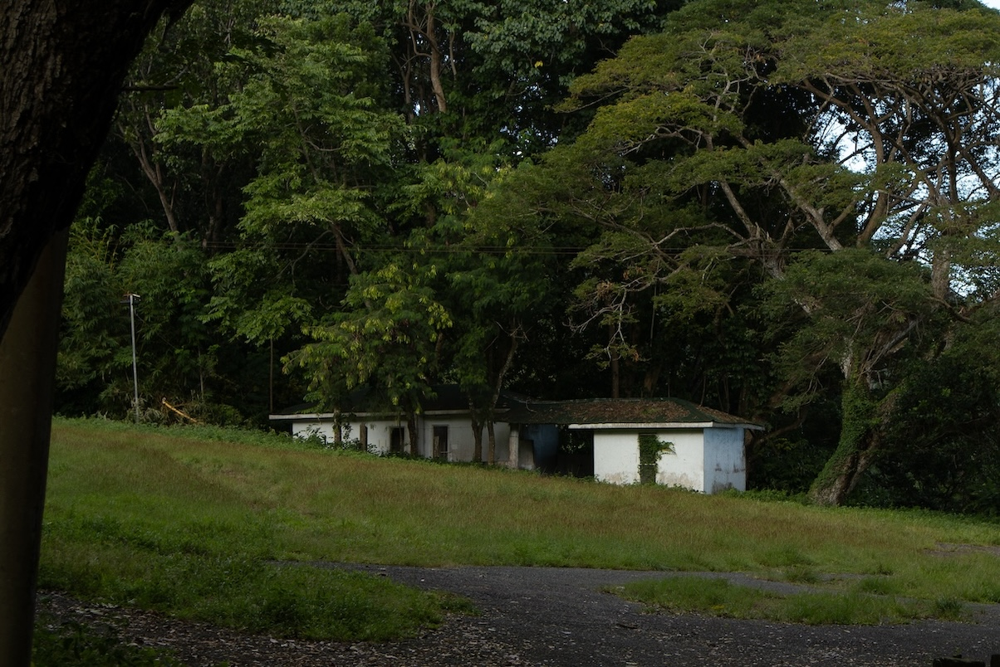
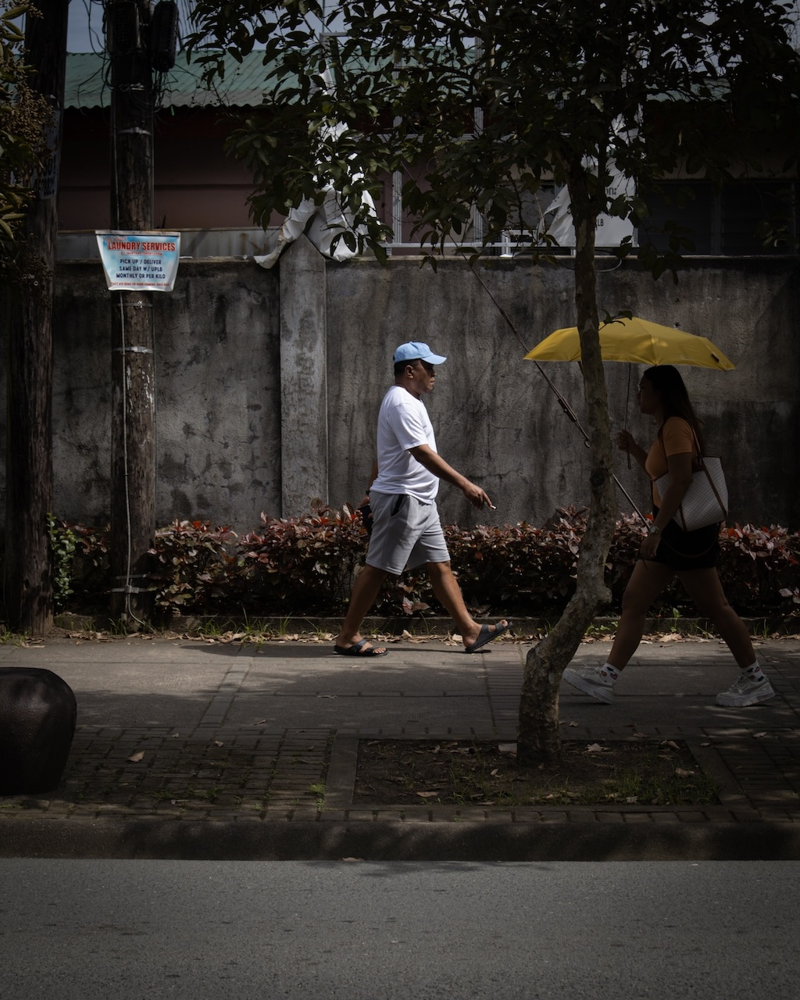
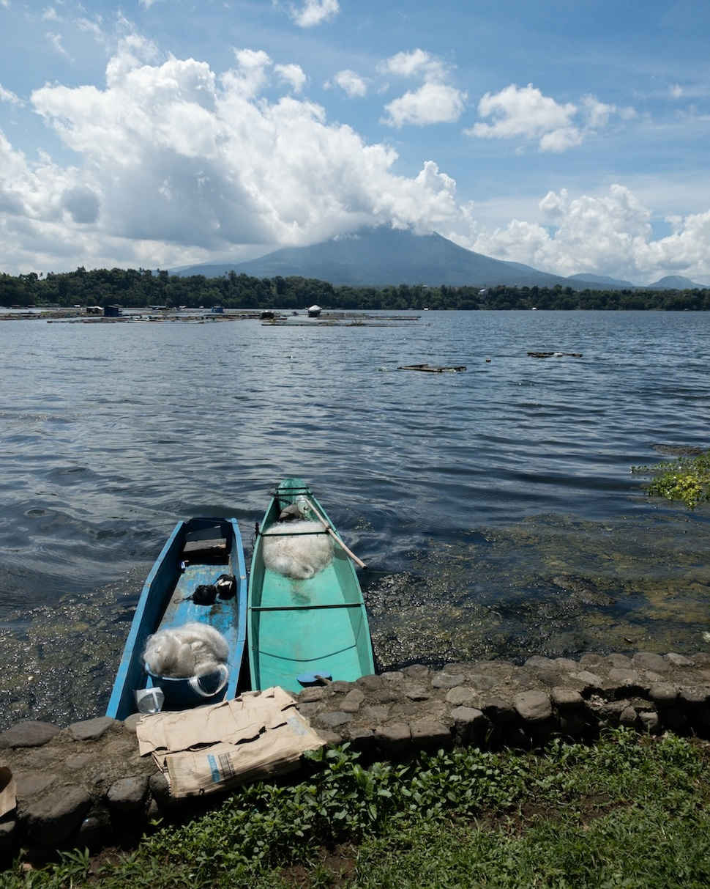
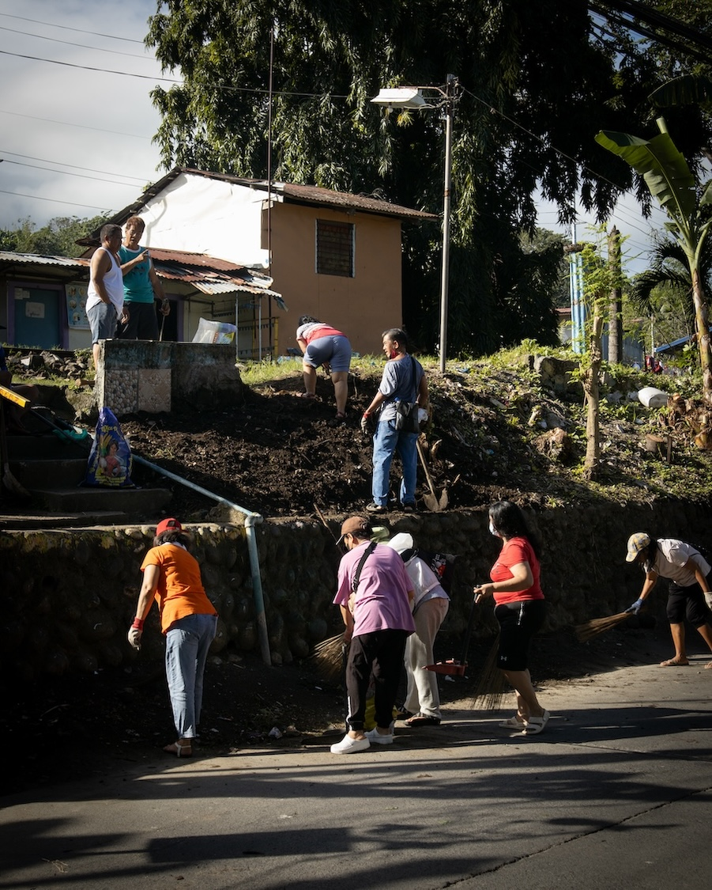
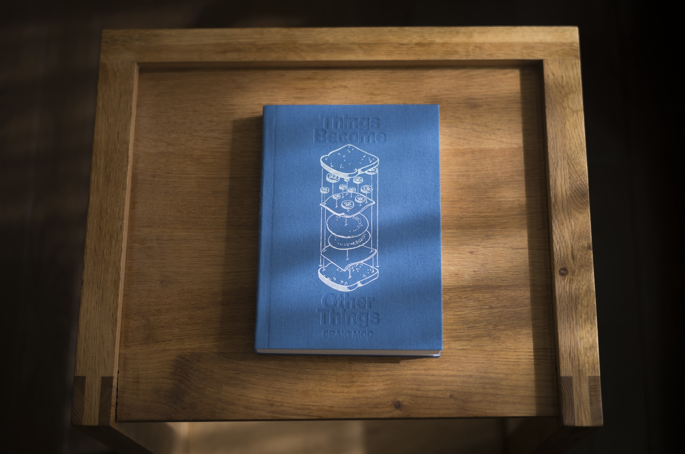

When we entered Raymundo Gate, a girl wearing a cap, a shirt, and leggings stood on the side of Velasco Ave. It's now almost six, and the light just broke out after a long night.

Two other youngsters walked toward our direction. Pieces of tarp held by golden pins hung on the front of their shirts. The tarps had numbers printed on them, and one of the teenagers handed a tarp to the girl waiting on the side of the road.

"Make haste. The race would begin soon," I told my partner.

We walked Aglibut Ave., Cuzner Ave., Mondonedo Ave., and Roxas Street faster than usual before passing by the Vet Med buildings that would take us to the Copeland Gymnasium in no time. From afar, we heard upbeat music frequently interrupted by the cheery voices of two hosts.

"Fur babies and their parents, the race is starting in ten minutes!" a host announced. Our steps got faster.
***

We signed up for the one-kilometer pet race because we wanted to bring Carillon, the calico kitten (now a full-grown cat) that we picked up from the Carillon Tower just a few meters away last year. Carillon was too afraid to leave the house, so we decided to join our friends, who were bringing their two dogs with them to the race.

That morning was hands down one of the best mornings of my life. From the moment we arrived around six until we left about eight in the morning, the smile on my face never faded. Being surrounded by that many dogs of different sizes and breeds made me feel something genuine and unpretentious—something I've never felt in a long time. Interestingly, the owners, who were as diverse as their dogs, all seemed to be kind and beautiful human beings. Everyone was approaching everyone, asking about their fur babies, stroking every pet's fur, and smiling, just smiling.

I'm not a morning person, but I'm delighted I woke up early.
***

December 2023, the last month of a good year, was filled with opportunities to commune with strangers and to experience through this communion something similar to what I felt that morning.

## Roots ྾ Gravel

From December 4 to 10, 2023, I finally did a project I had postponed long enough: a week-long walk around Los Baños. I walked for six days, taking a day off on December 6, when I noticed that my feet were aching and needed to rest. Ultimately, I took 114,814 steps to cover 72.59 kilometers, including 87 streets in 13 barangays.

In the email I sent to invite people to follow along with the walks, I articulated the rationale of the project:

>I’m doing this to honor Los Baños for everything it has given me for the past three years. This is one of the few places in the Philippines where I felt like people actually cared about their neighbors and the place they inhabit. It is the perfect place to explore the subsistent spirituality I’ve been writing about recently and see how this place shapes the life I’ve been trying to build here.

The missives (text + photographs) of that seven-day walk of Los Baños is archived [here](https://vinceimbat.substack.com/s/roots-x-gravel/archive?sort=new).

A few days after concluding the project, I reflected on how it affected me regarding writing, photography, and walking. In my journal, I wrote:

>The walks made me a better photographer. They got me better acquainted with my camera. I feel more familiar with it. I have understood what parts of it I still need to learn to use better. I now know I need to learn more about lenses, make a better call about when to use a specific ISO, and tweak the aperture when necessary.
>
>The walks also helped me become a better writer. They did so by showing me what works and what doesn't. Writing about an experience while still fresh has generated promising results. I got into flow writing in the late afternoon, making me wonder whether to tweak my schedule and do something similar: engage with the world in the morning and write in the afternoon or evening.
>
>I also learned a lot about my body's limits, especially regarding walking. Even if it was just seven days, it was beyond what my body could do. If I do another one, I need to be in better shape: eat right, sleep right. I also need to tweak the process and schedule based on what I can do. Perhaps longer rests? Alternate walking and days of rest?

One of the many challenges of walking, especially on busy roads, is sharing the roads and the sidewalks (if they're available) with others, both fellow pedestrians and motorists. Years ago, I wrote [[pagpapaubaya|a meditation]] (in Filipino) about the practice of "giving way" to others whom we meet on the road. I see now that sharing the road with others as a walker is a practice of patience and, dare I say, love, that I always find difficult—too difficult that I had to articulate [[some rules on sharing the road with others|some rules on sharing the road with others]] that I read once in a while when triggered by road behavior that irritates me. Interestingly, I noticed that I was less triggered when walking for hours and being around vehicles and pedestrians for longer than usual during this week-long walk of Los Baños.

During Roots x Gravel, I walked all but one barangay of Los Baños: Bagong Silang. About two weeks after the project ended, I published an essay about my first solo walk of Bagong Silang last November 2023. That essay was entitled "[[and i shall hear their hearts beating|And I Shall Hear Their Hearts Beating]]."

## Photographic Re-walking

Because I put a lot of time into my writing in 2023, my photography has suffered. Roots x Gravel allowed me to return to photography, practice the craft, and rethink my systems. With my photo library growing because of these walks, a photo backup system should be in place. After listening to advice online, I invested in a 2TB Sandisk external SSD to serve as the primary storage of my photo archive. I then backed this archive up in the cloud through my Backblaze account.

Next, I invested several hours going through my existing photographs, culling the albums, adding metadata, adding keywords, adding GPS coordinates, and renaming the best ones. While doing these, I had to return to photographs I took last year during [[a never-ending walk|my long walk from Los Baños to San Pablo]]. Returning to these photographs, I noticed, was almost like re-walking that route. Especially when fixing the GPS coordinates of the photos, I learned new things about the walk I never knew before, such as what barangays I passed by during the walk.

With the help of a mentor, I was also able to think about ways to print my photos and what lenses to consider buying for future projects. In photography, as in writing and spirituality, a good archetype to follow, such as a mentor, a friend, or a teacher, could accelerate the deepening of one's practice.

## Walking as Intersectional

One of the feedback I got from [[anww20|ANWW20]] was that I should begin thinking about "others" when writing about my walks, not necessarily integrate them into my writing but just think about them. These others share the roads I use but are of a different gender, disability status, ethnicity, socioeconomic status, age, etc. Aside from these, I should also begin thinking about the many others who don't walk because of physical disability or the current social structures that make physical spaces unsafe for them.

Some months ago, I mentioned on [[uman 2023-10|this newsletter]] that I was working with a fellow writer on exploring the walking methodology through epistolary essays. I spent a significant chunk of my December in dialogue with her regarding the intersectional nature of walking and how we, as writers, could bring this sensitivity to intersectionality into our works.

In one of the emails I sent to my collaborator, I wrote the following:

>One's location on the landscape is not just a physical point. It's an intersection where norms, history, gender, and other social categories converge. In short, the walking method is inescapably intersectional. When I'm standing at the intersection of Espino Street and Mondonedo Street inside UPLB, I see artifacts of colonialism (Baker Hall and the half of Freedom Park surrounding the fertility tree). This was once the Japanese internment camp. And yet today, the same spaces are used for events, and people go here for recreation. So, these spaces are socio-historical. Even when walking alone, I'm never truly by myself. I'm surrounded by reminders of the past, which now bring reconstructed meanings and new narratives we've attached to them. When I walk in these spaces, I cut through their meanings with my own multiple layers of meaning: my gender, my multiple disabilities, my spiritual and religious background, my regional identity, etc. So, a writer who chooses a walking method can never escape these layers and intersections. Even if they don't write explicitly about these subjects, since they walk on multi-layered grounds, they must consider them at least while executing their project. But this also means that since walking is rigorously intersectional, a work borne through it will most likely be complex, which warrants a multi-layered reading. Our letters can never be about one thing.

## Things Become Other Things

If you've been reading me for a while, you'll notice that I often reference [[craig mod|Craig Mod]]. While I've been playing around with writing and photography throughout my 20s and I've been a walker for as long as I can remember, Craig's work introduced me to the possibility of combining writing, photography, and walking into a single art practice. I wrote about [[good art reorganizes your world|how I encountered him back in 2021]]. I've studied his work closely in the past three years by reading as many of his newsletters as I could manage, studying his systems and practices as a member of his [Special Projects membership program](https://craigmod.com/membership/), and reading his first book *[[kissa by kissa mod|Kissa by Kissa]]*.

This December, Craig released the first edition of his second book *[[things become other things mod|Things Become Other Things]]*. I read Craig primarily to study craft (vignette writing, photography, and text + image juxtaposition), and this is what I did for a good chunk of December, particularly the last week before Christmas. Every morning, I spent a couple of hours reading a few chapters and taking note of a few things I learned.

One of the creative writing strategies employed repeatedly in TBOT is related to something I mentioned above about walking—how a walk is innately intersectional. Craig writes several of his vignettes using a version of the following formula:

1. He describes the landscape he is walking.
2. He focuses his description on a specific person, place, or object in the landscape.
3. He finds a story around that subject by remembering his personal experiences, citing information from his interviews with people he met along the road, or sharing tidbits from the books he had read about the place.
4. He then wraps up the vignette with a witty, poetic conclusion that ties everything together.

Here's a sample of one of his shorter vignettes, which illustrates the formula:

>**Immutable Stuff**
>
>When I imagine the peninsula as a god itself, I see a creature for whom it's as easy to summon a thing into being as it is for us to say a word. The peninsula desires a shack and by that desire — of earth and rock and worm and leech — a shack manifests. The peninsula desires an abandoned barn, and there it is, as it always has been, for as long as the peninsula wants it to be.
>
>As a kid, the whole world felt preordained, immutable. Everything about the old town simply was, always had been, and always would be. There was no old town without Bryan. Of *course* he was there. Of *course* we met. This was the way it was meant to happen. Some God of airplane engine factories ordained it, and thus from the tobacco fields we rose.

Overall, TBOT was a beautiful and instructive book to read, and anyone who aspires to write about and through walking would find it an excellent addition to their library. It gave me some ideas on how to approach my walking projects moving forward, including a book about my walks in Los Baños, which I hope to start writing this 2024, and a walk around Baguio City, which I plan on doing a few days from now.

