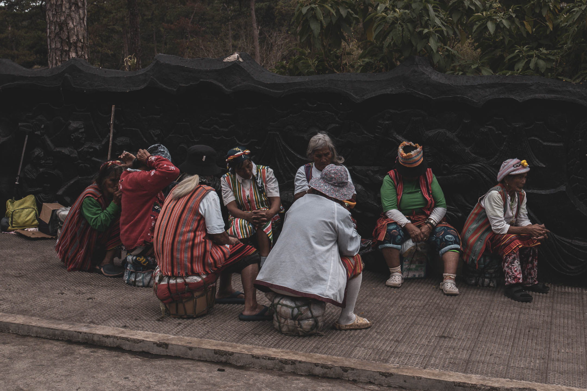
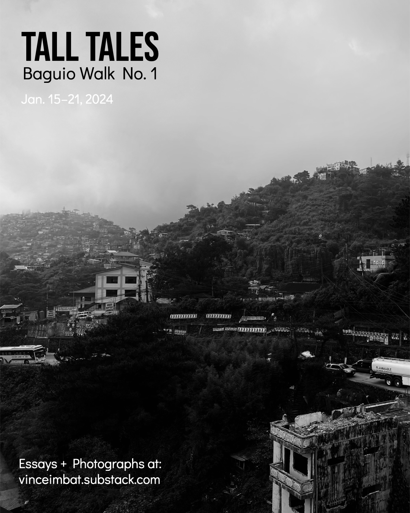
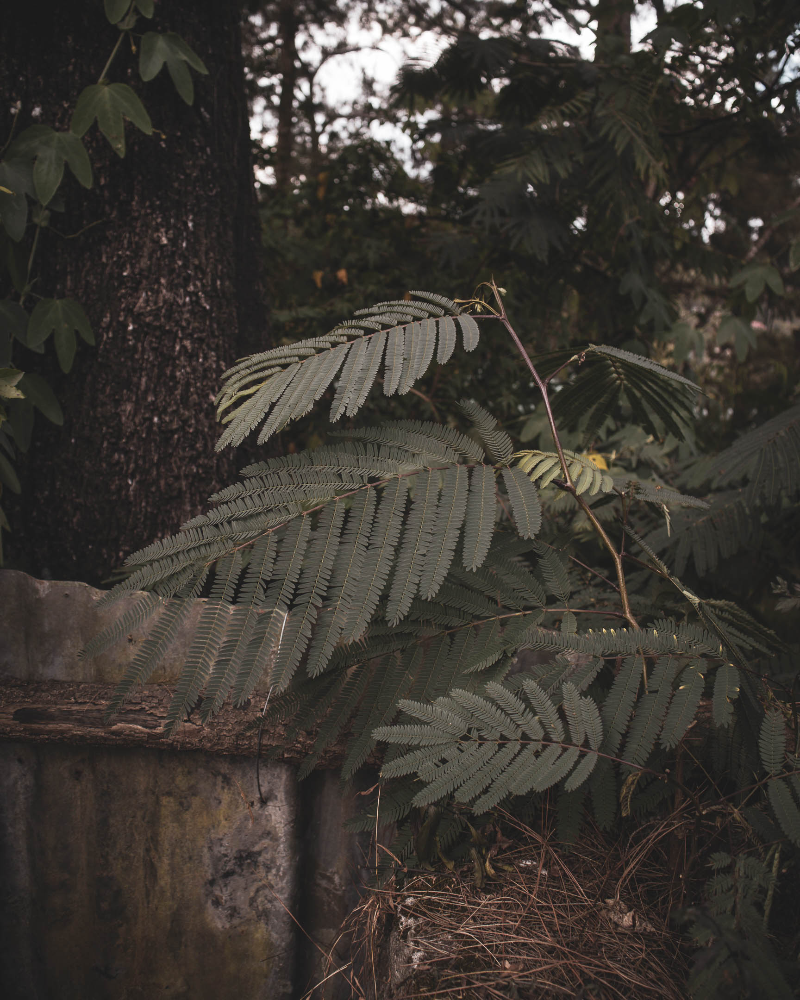

Each shadow  
shortens  
all morning long  
until it vanishes  
into the small dent of noon  
and the builders of shadows pause.  

— Gary Whited, "Shadow Builders"
***

Welcome to 2024's first issue of Uman, a word that means "change" and which I've been using to collate ideas, verses, images, and conversations in the past 30 days. Writing this "report" helps me keep track of any progress I make in this long walk of mine, a sort of written photograph of my intellectual and aesthetic footprints. I'm still unsure whether this is of any value to you (can you let me know if it does?). At the very least, I hope it could be a lovely quick weekend reading for you.

## Looking Back

On the first week of January 2024, I took some time to write [[uman 2023-12|the final issue of Uman for 2023]]. I also paused to look back at the year that just passed. This annual review has been a tradition I've kept for more than a decade, and it has helped me articulate the most important things to prioritize in the year ahead. After publishing my [[2023 annual review|2023 annual review]], I knew authenticity and focus were my main themes for 2024.

## Walking Baguio

After finishing my annual review, I immediately shifted my attention to preparing for my [[tall tales 1|week-long walk of Baguio]] from January 15 to 21. To consult about the design of the walk, I called [[louise far|Louise Far]]. The first question she asked me was, *"How will you protect yourself while doing it?"* The question caught me by surprise. I knew the walk could be triggering, but I didn't consider this in my initial design.

My consultation with Louise convinced me to refocus the project from merely remembering to also returning and reimagining the places I'm revisiting. As I articulated in the [[baguio walk 1|introduction]] to the walk, I decided to treat each walk like a meditation anchored in the present moment, which served as a refuge to potentially triggering memories and emotions.

I did three walks and sent five missives, including the closing essay.

- [[tall tales day 1|Day 01 — Firsts]]
- [[tall tales day 2|Day 02 — Families]]
- [[tall tales day 3|Day 03 — A Walking Kissa]]
- [[tall tales day 4|Day 04 — Night]]
- [[tall tales end|The End (For Now)]]

I learned a lot about myself and my relationship with my religious past from these walks. The walks made me realize that I'm sincerely curious about what happened to the friends I left in the church and that I welcome any possible future encounters with them—encounters where I hope to be my most authentic self. The walks also strengthened my resolve to understand how I can best hold space for my neighbor, no matter how different their beliefs are from me.

## Therapeutic Journey for the Free Spirit

At the end of the Baguio walk, I spent about a week with my parents at Pangasinan. While there, I re-read [[andrew j brown|Andrew J. Brown's]] article ["The Freedom to Be Tomorrow What We Are Not Today](https://andrewjbrown.blogspot.com/2022/05/the-freedom-to-be-tomorrow-what-we-are.html), which contained a section about [[friedrich nietzsche|Friedrich Nietzsche's]] four-phased journey for the free spirit. Andrew told me it might help me think about the Baguio walk. I also read the first chapter of Gordon Bearn's book *Waking to Wonder* (1997), entitled  [[superficial out of profundity bearn|"Superficial—Out of Profundity,"]] which provided an enlightening description of the journey.

Reading these two texts helped me understand that I'm still healing from leaving the JWs. To finish my healing process, I must recognize the things that brought warmth to me in my past life that I could still incorporate in my present life, albeit differently—things like faith, prayer, and ministry. Reading about the framework helped me understand that returning to places from my past brought out emotions that inform where I am in my healing journey and that walking to these places facilitates this process of incorporation.

I realized that engaging with existence makes me feel warm, i.e., seeing how ordinary objects and events are portals to existential questions and emotions. Nietzsche helped me visualize a thriving life entirely outside the metaphysical tradition I inherited—a life where I see things as they are, as if for the first time, fragile and transient, and, therefore, precious and near. I wrote an essay ([[where the sun warms|"Where the Sun Warms"]]) to summarize my insights from reading about the framework.

***
A few days before I left Pangasinan to return to Los Baños, I had dinner with my parents, my sister, her husband, and her husband's sister, who was visiting from Palawan. All of them were in the faith. While it wasn't the first time I'd broken bread with this group, the dinner had a different flavor, given my recent reading of Nietzsche.

After hearing my brother-in-law say the prayer (which I listened to closely), I began asking questions to the group, questions that didn't avoid talking about their faith. I asked about friends I once had in the church, particularly the old ones, hoping most were still alive. I asked my sister and her husband how their friends in their congregations helped them in their wedding. I jokingly asked our guest from Palawan whether she had found any pleasing gentleman in the congregations she visited in the north. And then, when I felt like I needed to give them space to talk about the assembly they attended in the morning, I stood up and volunteered to do the dishes, listening to them nearby speak about people whose names I no longer recognize and subjects I no longer remember.

The night went just fine. After seeing them off that night, I took a quick walk toward a nearby field, dried and cold as it is at this time of the year. I could hear the sound of a water pump nearby as I raised my head toward the sky adorned by Jupiter, Saturn, and the constellations. I stared there for a while.

Healing isn't done yet. But the warmth I feel inside has been staying here longer—longer, even in the middle of days cold as these.

***
