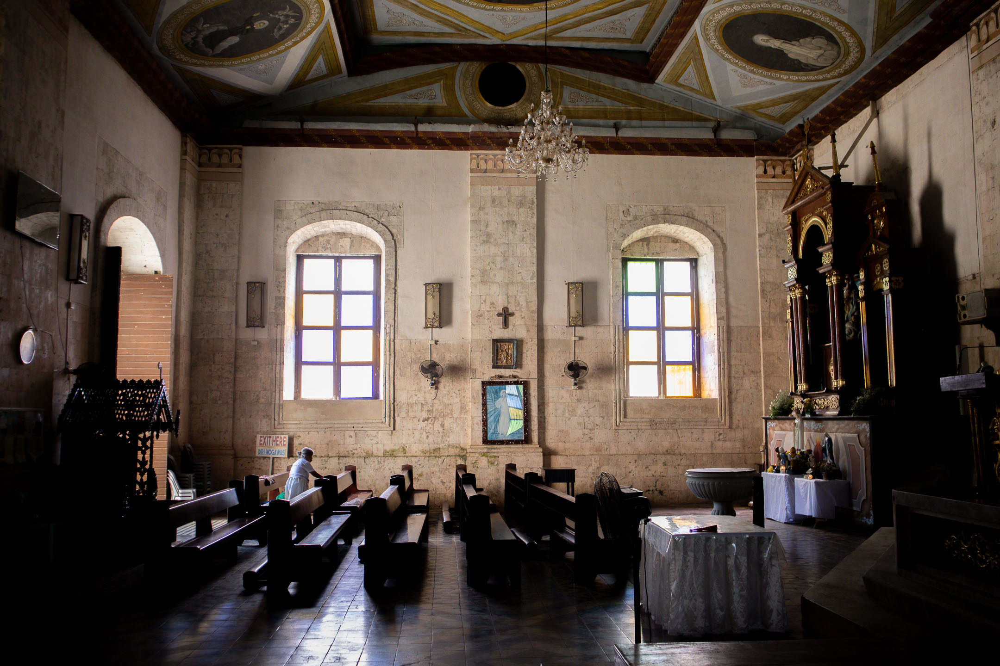
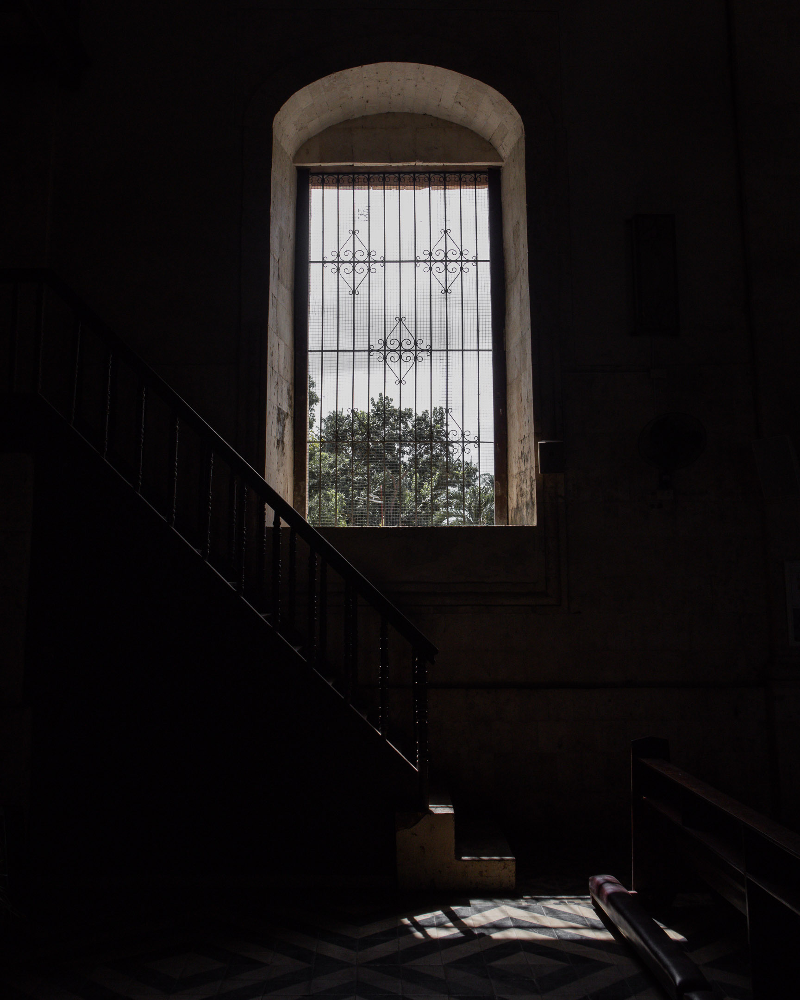

After the [[tall tales 1|first Baguio walk]] in January, through some reading and reflections on [[where the sun warms|Nietzsche]], I understood that to complete my healing journey, I must continue incorporating elements of my religious past that worked for me into the [[jiyu shukyo|free, creative spiritual and religious present]] I now find myself in.

I'm now comfortable describing myself and my work as "religious" and "spiritual." I've also started using the concept of [[faith]] in describing aspects and events in my daily life that elude predictability. But there is more to be done.

## Positionlessness

While walking one night early in February, I was moved to write the following words on my phone:

>The reason why you were passionate as a JW pastor was that you really deeply believed in your position.

I then asked myself:

>Do you truly believe in whatever you believe now to be passionate about it?

One of the things that made my life easy as a Jehovah's Witness (JW) was that there was no ambiguity about things I knew I had to avoid (e.g., cigarettes, blood transfusion, sex outside marriage, etc.) and things I had to go toward (e.g., more hours devoted to preaching, personal Bible study, attending meetings, etc.). While inside that ready-made religion, the beliefs I was expected to uphold were clearly articulated. I heard them twice weekly at the Kingdom Hall and read them daily in the publications. As a member of a century-old international religious organization, I enjoyed a clarity of vision that made me feel comfortable, safe, and secure. The path was laid out in front of me. All I had to do was walk it and follow all those who came before me.

As a child, I used to hear the precautionary story about the Israelites, who, en route to the promised land after being saved from Egypt, had to wander around the wilderness for 40 years after disobeying Jehovah. At the Kingdom Hall, the elders used the stark contrast between the experience of walking in the wilderness and living in the promised land to emphasize the difference between being part of the organization and leaving it.

They were right. Living outside of organized religion has been a wilderness experience, at least for me. Most days, I feel like I'm just walking with no particular destination. In the past 12 years, I've been mostly alone in this spiritual wilderness. Here, there is no clarity of vision. If there were any hopes for a clear destination, these were all short-lived. The spiritual wilderness is in constant flux.

And so, to answer my own question: Do I truly believe in whatever I believe now to be passionate about it? My answer would be an easy "No." The path I found myself on after leaving the solid walls of organized religion is a path where belief—latching on to an idea—is less valuable than openness. Of course, others would have a different experience, but I'm not the only person who has reached this conclusion.

My intellectual history from 2012 to 2024 was filled with faux beliefs. Eager to latch into the next big thing, I engaged in a pattern of committing myself to ideas and belief systems only to find myself questioning them later. Atheism, humanism, socialism, Hinduism, Advaita Vedanta, Zen Buddhism, environmentalism, Stoicism, and more—at various points along the way, I was convinced that each of these isms was my quest—the big thing that would explain my entire life and fill the giant hole left by Jehovah. But every time I committed to one, I would later leave. This happened many times that, around 2021, I knew I was already exhausted, and perhaps it was the reason why I started entertaining the idea of returning to my religious past and finding things I could incorporate into my current life.

Ever since contemplating incorporation, I started entertaining the idea that perhaps it isn't belief that I should aspire to but openness. Each moment in my life occurs as something new, a miracle that only reveals itself at this moment. To use a single "ism" to respond to each moment is doomed to fail. So, instead of seeing this lack of strong beliefs and my tendency to ascribe to weak thought as a liability, I may begin seeing it not only as my new normal but also as an asset. In Paul Wienpahl's (1916–1980) words, it might be helpful to begin seeing myself as a "man without a position."

This "positionlessness" is, of course, still a position. A danger inherent in it is that it might encourage someone not to take a stand when necessary. This doesn't have to be the case. Positionlessness doesn't have to mean not taking any position at all. Letting go of a single position means I open myself to more positions. Therefore, positionlessness is positionfulness in disguise. Being a man (or a woman) without a position means rejecting the imposition that one should never change. This is, of course, a position—one that a man without a position constantly takes.

To illustrate positionlessnes, think photography. I love this illustration offered by [[andrew j brown]]:

>I always try to pick up my camera and go out into the world without a ready-made, fully worked-out blueprint, theory or plan about how, when or where to take a photograph. In this sense, what the surfboard is to the surfer, the camera is to me the photographer. In doing this I’m attempting to keep myself open to whatever whooshes-up or shines before me, whether that is in the form of an obvious “subject”, “view”, or a simple passing play of sunlight and shadow. When something does whoosh-up or shines before me, I stop and take a photograph. To do this I must, of course, temporarily “take a position.” Not only by standing still in this or that place but also by taking a position with regard to the camera settings I am going to use, the f-stop, the shutter speed, film speed and whether to shoot in black and white or colour. Now, were I never to take this or that position with regard to all these things, I would never be able to take any photo (good or bad). However, it is vitally important that, having taken a photograph, I never become wholly wedded to this or that particular position, subject, view, passing play of sunlight and shadow or this or that set of settings—instead, I must move on, intra-actively, on the crest of the unfolding world, to attain another perspective and so allow something else to whoosh-up or shine before me which calls me to shoot, click!

Walking is also a good illustration of positionlessness. The main point is that in a state where one rejects the need to take a stand and stay there as long as one can, one recognizes that a position at any given time will always provide an incomplete image of its subject. Walking (or any form of movement) allows one to see other angles that, although it will not complete one's vision, will provide a better picture and understanding of a subject.

## Charles Olson and Incorporating Ministry

One of the things that worked for me in my religious past was that I had a ministry: I learned sign language and taught the Bible to people who were deaf or hard of hearing—something like [[shinichiro imaoka|Shin'ichirō Imaoka's]] ikigai or [[henry david thoreau|Thoreau's]] quest.

A result of not having strong beliefs is that having something with the shape of ministry is not a given. As I latched into ideologies and left them, so did my sense of purpose. I may not need belief in the spiritual wilderness, but I do need some sense of direction. And this is why I think I resonated very much after reading about [[charles olson|Charles Olson]] via Andrew James Brown.  In the article [The Freedom to Be Tomorrow What We Are Not Today](https://andrewjbrown.blogspot.com/2022/05/the-freedom-to-be-tomorrow-what-we-are.html), Andrew wrote about Olson:

>Olson tells us that the work of the morning “is methodology: how to use oneself, and on what"

Indeed, how can I use myself, and on what?

As a JW minister, my dream was to be a missionary, which involved working directly with people and tangibly seeing the effect of my work. However, after my depression and leaving the JWs, I noticed I became more invested in more solitary activities like writing, studying, and photography. These helped in my healing. But I'm now feeling an itch to get out there and do something that puts me in more direct contact with people I want to help. How can I experience "ministering" to others directly in a free, creative spirituality?

Through Andrew James Brown's help, I unpacked this question. The first thing to do was to question the idea of "ministry" itself. In a free, creative spirituality, the idea of having one person minister to a group will have to be dropped. Instead, each group member should be seen as a minister, and the ministry should be spread out rather than concentrated on one person or a few. Since everyone relies on everyone, it is even more critical to ask oneself, what is my methodology? How can I be of use to others?

## Writing as Ministry

As religious activities slowly left me, I noticed myself leaning more and more toward writing. Given the circumstances, it was inevitable that most of my writing experience was inward and solitary. One thing I'm considering now is making this outward. One option is to facilitate writing in the tradition of the [Amherst Writers and Artists (AWA) method](https://amherstwriters.org/), a tradition laid out in the founder Pat Schneider's book *[[writing alone and with others schneider|Writing Alone and With Others]]*. I could use the AWA method to facilitate writing workshops for people like me who are going through spiritual and religious ambiguity. But how about the act of writing itself? How could it be a form of ministry?

In answering this question, it is helpful to return to Olson. Andrew said:

>He [Olson] wants us to create things where the form they take perfectly, and immediately, expresses the content; where our poetry, music, acts of social justice and worship, are the fullest possible expressions of ourselves and not merely inauthentic, arty or moralistic clothing.

For writing to be a form of ministry, it has to stop being simply an aesthetic practice used only to express ourselves beautifully. Instead, it has to attempt to be "the fullest possible expressions of ourselves." Any project with such a goal involves showing even what is ugly.

Thinking about this statement by Olson, I'm reminded of two things I've read some time ago. First is the conclusion Lawrence Buell reached after studying the American transcendentalists' literary method. In his book *[[literary transcendentalism buell|Literary Transcendentalism]]*, Buell concluded that the transcendentalists theorized writing not simply as a tool to express the creative genius they believed resided within every human being but also to serve as a tool to strengthen an ethical life unique to each of them (something like [[jiyu shukyo|jiyū shūkyō]]). This two-pronged purpose of writing informed their choices of form—the lecture, the sermon, the manifesto-note, the reverie, and the poem.

I also remember a paragraph I read from James Klagge's *Wittgenstein's Artillery: Philosophy as Poetry* (2021).

>Wallace Stevens, in “Of Modern Poetry” (1940), defines a poem as “the mind in the act of finding / What will suffice.” This seems to me to be true of any work organized lyrically: poems, certain sorts of essays, certain sorts of fiction. We see in such work a mind moving—noting and considering, listening to what it has just said, leaping forward or turning back. Rather than reporting on what will suffice, speaking from a position of arrival, this kind of writing dramatizes the act of getting there. What we do when we read such work, as Kenneth Burke illustrates …, is reenact that movement. We perform the poem, connecting image to image or turn to turn, making of its various parts a coherent inner action: “For a poem is an act, the symbolic act of the poet who made it—an act of such a nature that, in surviving as a structure or an affect, it enables us as readers to re-enact it.”

The problem with reading a beautiful piece of writing is that it is often too beautiful to trace where it came from. If writing is used as a form of ministry, it has to let go of aesthetics when it needs to be honest. It has to show where it came from, what twists and turns it took to get here, what dead-ends it reached, and how it got back so that we can see a mind unsure yet moving. A writing ministry favors honesty over beauty because it is through honesty that we can truly minister to the other person.

## Walking as Ministry

This leads us to walking's role in writing and the form of ministry that I could incorporate into my current writing life. Walking intentionally favors the messy. When one walks, it is only natural to have flights of thought as feet interact with matter, and matter affects the mind's current state. Unsurprisingly, walking as a writing methodology is often associated with writing techniques like [[streams of consciousness|streams of consciousness]].

Andrew suggested that I explore the works of [[phil smith|Phil Smith]], a performance-maker and academic who advocates a particular form of "radical walking" based on the twentieth-century [[derive]]. According to Phil Smith, radical walking emerged from anti-capitalist post-war European activists who rejected Stalinism in favor of "a Marcusean liberation of subjectivity, eros, desire, and exploration of irrational zones of consciousness, beyond the reach of mass media." Despite its strong sense of subjectivity, practitioners of the derive aspired to build communities around the walking they did.

In an essay in 2021 entitled *[[that which walks smith|That Which Walks]]*, Smith delineated a history of the walking arts in Europe (while walking artists exist worldwide, the craft is still heavily European). According to him, in the years before 2008, radical walkers were united in their "resistance against romanticist walking" that favored individualism. After 2008, finding a pattern among walking artists wasn't easy. He blames the lack of innovation within radical walking itself, which manifested in a lack of theories and practices. As the original focus of radical walking disintegrated, groups that became interested in the walking arts created their own theories and practices based on their own varied purposes. To make matters worse, very little documentation and communication among these groups happened. What developed was a highly open and diverse walking arts that embraced individualism, autonomy, and subjectivity (like the romantic walkers did) rather than collectivism.

Moving forward, Smith believes that the derive could return to its original collectivist aspirations by embracing the concrete materiality of the nonhuman. In a 2019 conference of walking artists in Plymouth, he detected and reported this tendency.

This history is fascinating because somehow, the history of the derive, as Smith describes it, mirrors the kind of jiyū shūkyō expressed by Shinichiro Imaoka in his [[imaoka principles of living|Creed of Life]]. In eight affirmations, Imaoka moved from recognizing a person's unique individuality to affirming that such individuality could only be nurtured in the context of a community and later moved to include the nonhuman world in that community. Here, I think, lies the key to seeing how I could use walking as a form of jiyū shūkyō ministry.

I plan to go deeper into Phil Smith's work, the contemporary derive, and other forms of radical walking in the Philippines. I'll see where this research brings me. My primary intention is to produce walking-inspired written artifacts and design walking experiences that could help people explore jiyū shūkyō.

## Kiitsu Kyōkai

This February, I also attended my first kiitsu kyōkai meetings. They're an hour and a half long meetings comprising [[seiza]] meditation followed by free conversation. Facilitated by Andrew James Brown, they're the sort of meetings that encourage the kind of jiyū shūkyō I'm currently exploring and writing about here. I attend the sessions on the second and fourth Thursdays of the month because they are friendlier to Philippine time, but another schedule is available. If you're interested, check out [the kiitsu kyōkai website](https://andrewjbrown.blogspot.com/p/kiitsu-kyokai.html) for more information.

## Website Improvement

Finally, I spent the last few days of February improving this website. Given the recent changes in my focus of interest, it is only appropriate to update the site's homepage and the about page. I also made the newsletters page more helpful. If you haven't yet, please visit them using the links below.

- [[_index|Home]]
- [[about|About]]
- [[newsletters|Newsletters]]

I also added a navigation menu to help you find what you're looking for faster. Lastly, I'm experimenting with a new newsletter application called [Listmonk](https://listmonk.app/). It's an open-source application, which means it's free and its code can be tweaked. Listmonk gives me more freedom to design the emails I send you. Making the switch also allows me to direct your attention to my website rather than my Substack archives. It's still an experiment though, so we'll see where it goes.

On that note, I'll end February's Uman here.

May your March be as always free.

