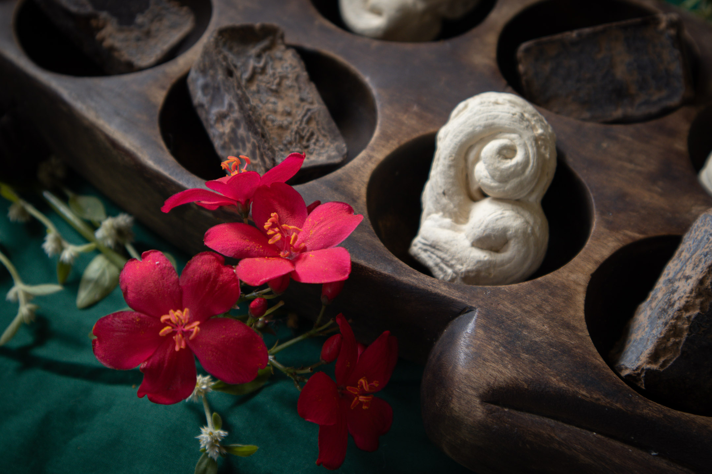
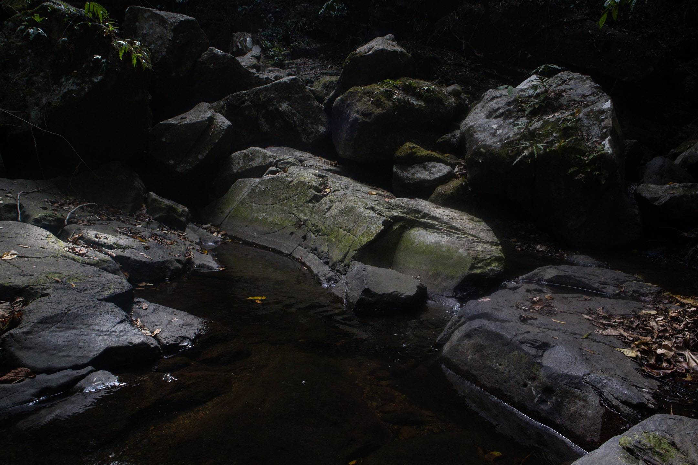
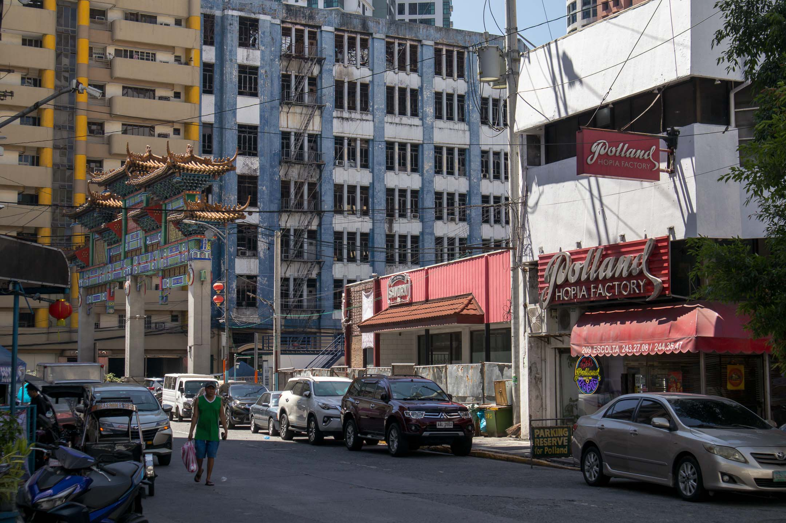
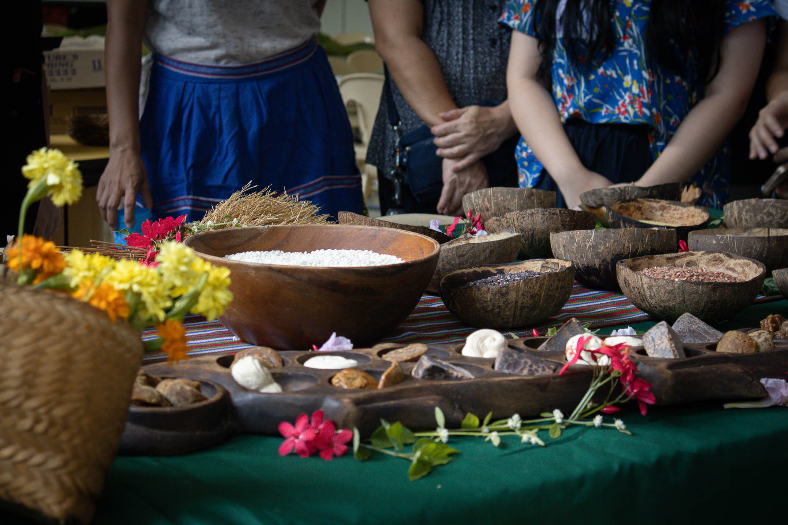
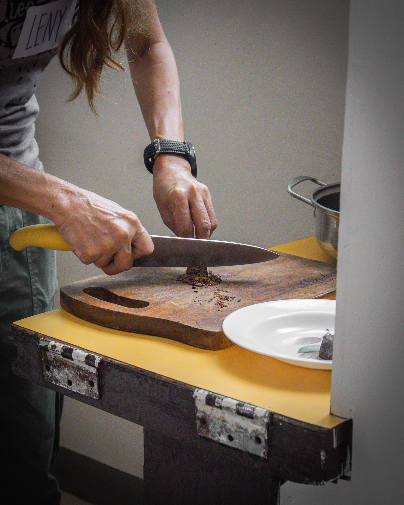
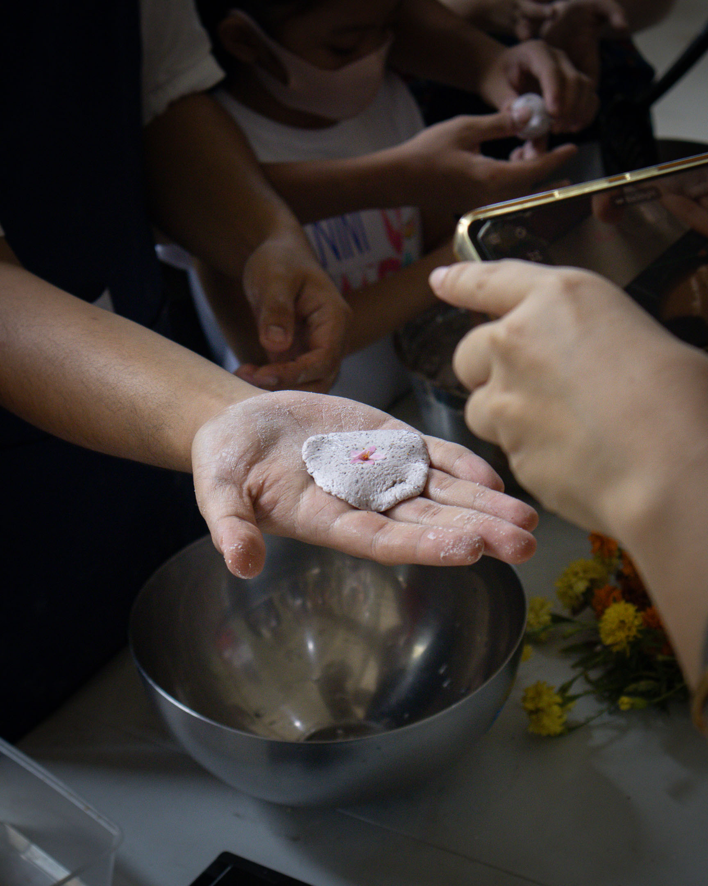
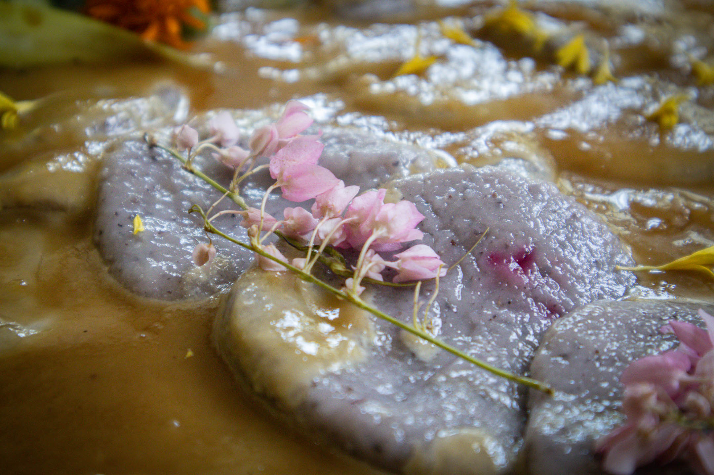

March was a month mostly of writing and rewriting and contemplating about writing. Some things did happen outside the letters and symbols on my journal and blinking cursors on my screen. But mostly, it was really just writing.

Here's another collage of what has been an ordinary yet instructive month.

## Buhian Essay

An essay I submitted to the upcoming [Buhian edition](https://ajol.ateneo.edu/katipunan/announcements/panawagan-para-sa-mga-papel-buhian) of the Filipino journal [Katipunan](https://ajol.ateneo.edu/katipunan) passed the initial screening and was returned to me for considerable revisions. I spent about two weeks working on the second draft (which doubled the essay length!), but, in the end, I was pleased with the result. Revising the essay helped me understand my own poetics and how it weaves beautifully with my spiritual stance, that is, [[jiyu shukyo|jiyū shūkyō]]. Doing so has been profoundly revealing, not because it clarified many things but because it opened up more questions to explore.

The essay, which might come out this April 2024, was about my walking and writing practice and the tools and system I use to execute it. It contains the first articulation of my philosophy of writing (which I am only now truly understanding) and its material manifestation, which I call the talahardin, or "garden of notes." The essay was written in Filipino, but I plan to release an English translation here in the newsletter if the editors permit me.

Among the things I enjoyed the most while revising were writing a short history of walking in the Philippines, reading the thesis [[authoring autonomy cruz|Authoring Autonomy by Conchitina Cruz]], browsing the literary folio [[sandugo|Sandugo]] (a collection of poems and essays written in tribute to the three thousand indigenous peoples who walked from all over the Philippines to Manila in 2016 as a form of protest), learning about the songs of the Ikalahan, writing about the [[dagli]], and contextualizing the [[talahardin]] in the current electronic media used in writing and reading in the Philippines.

## More Writing

Because of the revisions I made to the essay mentioned above and other freelance writing projects, I didn't publish that much in the newsletter this month. After sending the [[uman 2024-02|February issue of Uman]], I could only send a short update about the page I recently created on the website, which I hope would be the most comprehensive resource on [[walking the philippines|walking the Philippines]]. That said, a draft of a [[burning fields|poem]] did come to me one night in the middle of my sleep. I woke up with the words floating over my head. It was a poem about the house I grew up in at Pangasinan, which is now in complete disarray after we all left it in 2021. I might visit the house this month to take photos and perhaps write something about it.

Speaking of Pangasinan, one of the few writers in my first language, Santiago Villafania, died this March at 53. He was masterful in his handle of the language and successful in putting Pangasinan literature into the Filipino literary scene, a courageous feat given the limited readership in this language. His death has affected many of us who speak the language and are trying our best to write in it despite the challenges.

In honor of him, I read one of his poems and shared the reading on social media. Here's the poem and my rough English translation of it:

### sonito 129

natan ta naandi ka la bilay  
duma la'y pakanengneng ed mundo  
aliwa lan malinak so labin  
pitutuyawan ko ed ilalam

saray kantikanti 'ran bitewen  
agla 'ra makaleksab ed dalin  
tinundaan da met lan aligen  
so kirlap tan yumis da'ra'y matam

anggapo la'y hambayo ed dagem  
tan saray un-uni na anuyiao  
a sipur iran manko-concierto  
no bansagan da so awawey mo

agla mangaanlong ira'y musiak  
Katawan! inatey ak la amo?

### sonnet 129

now that you are gone, life  
the world now looks different  
the night where my thoughts  
take their rest has lost its calm

the stars that shine bright  
no longer come to earth  
they've stopped to imitate  
the glitter and clarity of your eyes

there is no more comfort in the air  
no more songs of the sparrows  
that naturally sing when they join  
the dances of your mind

no more poems from my muses  
Lord! am I dead?

## Walking Binondo, Walking Flat Rocks

I managed to do some walking this month. A few days before Lent, I walked with some friends to the nearby Flat Rocks along the Mt. Makiling trail. It was my first time visiting the rocks, so I was looking forward to it. We stood, sat, and lay down on these rocks, proof of the mountain's volcanic past. We stayed atop those rocks for around two hours, a much-needed forest bath.

Earlier this month, I also walked Binondo, the world's oldest Chinatown. Located at the heart of Metro Manila, Binondo is home not only to famous Chinese restaurants but also to traces of the American architectural imperialist project. Here is a complex representation of the Philippines: an almost unrecognizable Frankenstein-like monster made up of patches of the old and the new. Here is a Chinatown in the middle of a Spanish plaza complex, surrounded by American buildings, bridges, and streets. While walking, I was constantly asking myself: Where is the Filipino? The answer, of course, is that it is everywhere. The amalgamation is the Filipino.

## Mindful March, Rice is Life

This March, I attended three one-hour sessions of Louise Far's Mindful March Contemplative Photography Workshop. I've always seen photography as a rest from writing, and with too much writing happening in March, Louise's sessions were a much-needed break.

I really enjoyed the last session, when we were prompted to take a photo of our hand. Since I am right-handed, I took a picture of my left hand, which was tricky when using a DSLR. The process moved me because I realized I'd never looked at my hand as close before, and doing so, especially in dim light, revealing new emotions.

Using what I learned from Louise's workshop, I volunteered to photograph a community cooking event organized by some of my friends in my locality. The event was a tribute to rice, the staple food of most Filipinos, which is unfortunately mired by violence on many levels of society. We cooked four different rice meals, talked about the complex social issues revolving around the plant, and shared poetry about rice.

Here are some photos I took of the event.

***

Summer has begun in this part of the world. While heat indices in different parts of the country have skyrocketed, I'm grateful that Los Baños, given its proximity to a mountain and a large lake, has its mini weather system that somehow counteracts the heat. Our evenings, early evenings, and late afternoons are still relatively cold.

April is here, and with it comes more opportunities for walking, writing, contemplation, and being around people we love. I wish you a fruitful month wherever you are in the world.

Thank you for being here.