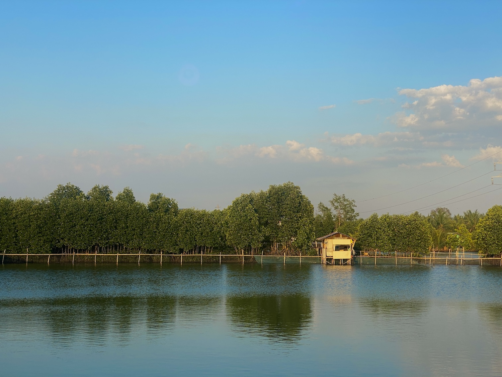

Hello friend,

This is *[[05 obsidian/tags/uman|Uman]]*, a monthly newsletter I ~~try to~~ keep. Its name means "change" in the language I grew up speaking, Pangasinan, which many believe is [dying](https://www2.hawaii.edu/~vanderso/Pangasinan.pdf).

You are receiving this because you subscribed to it days or months ago as a bundle to my other newsletter, [[05 obsidian/tags/tlw|The Long Walk]]. *Uman* is a collage of changes I went through in the past month, primarily while thinking about and practicing spirituality, walking, writing, and photography.

***

Inspired by some newfound insights after attempting to articulate my personal writing poetics through an essay set to be published by [an academic/literary journal](https://ajol.ateneo.edu/katipunan), I spent most of April doing some more writing and, as a consequence, thinking about its place in the life I'm trying to build these days.

The writing I did was an attempt to collate more than three years' worth of text I've written about [[walking los banos|walking Los Baños]] into two essays (perhaps, finally, the beginning of a book?). To begin the collation, I had to extract pieces of text ([[tags/vignettes|vignettes]]) from longer essays and newsletters I've written in the past, including the six essays I wrote for [[rxg|Roots x Gravel]], the week-long walk of Los Baños I did last December 2023.

But I'm most concerned about the writing meditation prompted by this month-long project. As readers of this newsletter would know, I've been trying to reincorporate certain aspects of my religious past as an ex-Jehovah's Witness minister into my conversion toward a [[jiyu shukyo|free, creative spirituality]]—a project I've been avoiding for years.

One of the elements of religious life I most enjoyed in the past is "ministry"—a form of service that is mainly directed toward the "other" (i.e., non-believer) in an attempt to bring them closer to the fold. As a JW, I primarily ministered to people who were deaf or hard of hearing in Baguio City, a ministry that required me to walk miles, leading to my affinity for walking as a spiritual practice.

Ministry, along with all other aspects of religious life, was lost after I left the JWs. What replaced it somehow was writing, something I did very little as a JW minister. Because of this, as I contemplate today the best way I might bring back a form of ministry in my life, I'm deeply thinking about writing's role in a free, creative spirituality and, perhaps more importantly, what it means to treat it as a form of ministry.

***

## Writing as Performance

This has to be thought about because writing is not often viewed as a form of service. Like all other art forms, it usually co-exists with this inclination to perform, entertain, and draw an audience. Therefore, the predominant way of viewing writing is to immediately get out of one's shell (i.e., from one's journals and diaries) and aspire for publication, that is, to produce something for an audience. The goal inculcated to many a writer is that the more readers one has, the better.

To gain readers, one needs to perform in front of existing audiences, something publications and more famous writers have. The main activities of a writer working to increase an audience are, therefore, working on craft, producing work, sending them to publications, applying some for workshops, and sending some to contests in hopes of gaining awards. All of these get easier when one becomes part of the academe (i.e., studying or teaching in a university with a press). To be published, workshopped, awarded, and institutionalized means to become a better performer, which makes one more suitable for a larger audience. In the Philippines, where the readership is still not as large as in other countries, the quest to gain readers is nothing short of a real competition. In this competition, the published, workshopped, awarded, and institutionalized dominates, taking the largest piece of the audience pie. Because of scant readership, attempts to counteract this prevailing system through self-publication still have limited effects.

***

## The Dark Side of Writing as Performance

Because of this prevailing nature of the writing life, it is very easy to be allured by the siren call of fame. Writing is a celebrity game. The only question is how famous you are. Without care, one could easily fall to "the dark side." In the Philippines, in 2022, a nationwide contest for writings written in regional languages was hi-jacked by [plagiarists](https://www.rappler.com/life-and-style/literature/national-committee-literary-arts-release-final-winners-2022-gawad-bienvenido-lumbera-contest/) willing to do anything to win the awards, including sending poems they ripped from the social media posts of a well-known Pangasinense poet. A few years before this, a certain writer from the Southern Philippines faked his credentials (i.e., publications, workshops, and awards) and fooled the Filipino literary community until his unraveling in what became [a nationwide scandal](https://www.rappler.com/moveph/225258-hoax-literary-credentials-writer-cagayan-de-oro/).

Reacting to the plagiarism mentioned above, Joel Pablo Salud, a journalist turn spiritual writer, said this:

>Plagiarism is a sign of an even deeper malady: the craving to be famous. Writing is not about discovering fame. Writing is about discovering yourself. Within that cumbersome isolation of writing, what do you see?

***

## Two Elements of Writing as Ministry

Joel's question underscored what I've been contemplating about writing and its role in religious and spiritual life, especially when conceptualized as a form of ministry.

In my experience, there are two elements of ministry: self-fulfillment and service. First, a ministry has to feel good. Doing it should be rewarding in itself. It is nurturing to one's own spiritual life. Second, ministry always serves a particular community. It improves the lives and spiritual well-being of a group.

Pursuing writing as a ticket to fame endangers one's view of oneself and never serves anyone. If writing lies in a spectrum, and "writing as a celebrity game" is at one end, what is at the other end is "writing as therapy." This is writing done only for the self, never meant to be shared with anyone. Some people, such as those who use writing to heal from trauma, need to stay in this form of writing for as long as they need. However, because of its exclusivity, it doesn't fit the bill of writing as a ministry. For writing to be a ministry, it needs to lie midway between one's desire to heal oneself and one's desire to be read.

***

## Pat Schneider

When thinking about writing as a form of ministry, I remember [[pat schneider|Pat Schneider]], who, although published, awarded, workshopped, and institutionalized, used all of these to reconstruct how writing is practiced to be both self-fulfilling and service-oriented.

She founded a writing method called the [[awa method|Amherst Writers and Artists (AWA) method]], detailed in her book *[[writing alone and with others schneider|Writing Alone and With Others]]*, which follows the following five affirmations:

1. Everyone has a strong, unique voice.
2. Everyone is born with creative genius.
3. Writing as an art form belongs to all people, regardless of economic class or education level.
4. The teaching of craft can be done without damage to a writer’s original voice or artistic self-esteem.
5. A writer is someone who writes.

Following these affirmations, Schneider prescribed a writing practice that begins with protecting the voice of a budding writer, which is always in danger of being curtailed by the violent voices of criticism. Schneider believed that a writer (which everyone is) deserves a safe environment where their voice is given the chance to flourish. Throughout its history, the AWA method was used to give voice to historically underserved communities, such as incarcerated women or women living in low-income communities. Those who were helped by the method train to become facilitators who conduct writing workshops for groups who need their voices to be heard the most.

***

## Fr. James Martin

I also remember Fr. James Martin, the Jesuit priest famous for his radical stance against the Catholic faith's outdated discrimination of the LGBTQ faithful. In April, I spent an hour or so watching an interview he gave about [writing as spiritual practice](https://www.youtube.com/watch?v=QIz8-W30T6A&pp=ygUqd3JpdGluZyBhcyBzcGlyaXR1YWwgcHJhY3RpY2UgamFtZXMgbWFydGlu).

Fr. Martin's writing practice fits the "writing as ministry" perfectly well. First, there is an intentional desire to keep the writing as fulfilling as possible in his practice. He describes his writing practice as happy and consoling. He says he doesn't feel pressure when writing, and this is because he doesn't make a living out of it. He also doesn't see it as a career, nor is he writing for good reviews, promotion (as is the case with most academics), or sales. He writes what he wants in his own time, and no one assigns him his subjects (as with journalists). Because of this, his writing sessions are one of the most pleasurable times of his day.

However, Fr. Martin's writing practice is very much directed toward his readers, whom he calls "souls." According to him, he wrote books primarily as a spiritual director who answered questions people asked him about spiritual life. He describes himself as a Jesuit priest who happens to write and says he writes to help souls and not to make art. Because of this poetics, he is compelled to write clearly rather than beautifully. Because his words need to serve others, he writes as transparently as possible, showing his struggles to illustrate to his readers that it is okay to struggle and that there is no need to be embarrassed about it. He said that one of the goals of writing as a form of ministry is to create an intimate bond with one's reader through words. He draws inspiration from [[thomas merton|Thomas Merton]], another writing priest, who once said:

>"I don't know if I really became a true monk, or a true contemplative, but what I do know, is that I am a writer, that I was one before I entered the monastery. I'm still one, and I'm going to remain one."

***

## Rem Tanauan and Rofel Brion

Top-of-the-mind Filipino exemplars of writing as a ministry are [[rofel brion|Rofel Brion]] and [[rem tanauan|Rem Tanauan]], both of whom I know personally. The late Batangueño poet Rem Tanauan was a close friend who intentionally pursued a writing practice situated on the fringes of the Filipino literary community to keep it personally fulfilling and close to his own spiritual aspirations. He never attended school to receive formal training in writing. His only training was from a famous poetry organization in the country, a training he often cited as the reason why he quit writing for about five years before finding the courage to return to it again.

His intimate and spiritual relationship with writing didn't prevent him from serving a community, though. When the whole world was forced to quarantine in 2020, Rem launched an intensive online course on poetry he called Tungko ng Tula (Tripod of Poetry). His first students were people like me who were coming to poetry for the first time and looking for spiritual comfort through writing in a time of isolation and fear. He continued teaching his course for three years, serving four batches, until he died in October 2022. Those touched by Rem's words and "ministry" were too many we had to hold two long nights to accommodate those who wanted to speak in honor of his memory.

Then there's Rofel Brion, of course, who himself is an institution in Filipino poetry. Unlike Rem, Rofel was well institutionalized, having been trained in writing in the country's top schools. He is also published, awarded, workshopped, and well-connected to the literary community. It was surprising, therefore, to hear from him in [a podcast interview](https://www.kevinnchan.com/2020/11/24/radio-ep-8-rofel-brion/) he gave that he doesn't take his writing seriously, and this somehow leads to his success. Most of his poems were written during the retreats he took. Reading his poems is like reading prayers. Many of his writings are also dedicated to specific people in his life: family, friends, and perhaps even the people he has guided. These people are his audience. Rofel is a teacher and a spiritual guide, and these roles take over his life more than the writing. The writing he does is an expression, an extension of his ministry.

***

So, I return to my question: How could I modify writing to become the kind of ministry I want to incorporate into the new free and creative spirituality I'm currently exploring?

I don't have complete and certain answers to this question, but based on the thinking, reflecting, and trying out I did in the past weeks, here are a few thoughts worth considering.

1. Perhaps, I could decrease the time I spend on producing works meant for publications, contests, and workshop applications. Unchecked, these could easily take all of a writer's time. To explore a more ministerial form of writing, I need to make enough time for it.
2. Perhaps, I should also put aside an initial plan I had to pursue graduate studies in creative writing. I have no doubt that graduate studies would help me improve my craft. What I'm unsure of is whether it would help me nurture a fulfilling relationship with writing and encourage me to see it as an act of service more than an art form.
3. The time I save from letting go of pursuing publication, contests, workshops, and additional schooling might be better spent understanding who it is I want to serve, finding them, connecting with them, engaging them, and understanding what they need.
4. By deeply understanding the needs of my ideal reader, I could shape a writing practice dedicated to providing works that could potentially make a difference in their lives.
5. In addition to all these, I could invest more time in making sure that my writing sessions remain fun and fulfilling. This could include spending more time on forms of writing I know I already enjoy, such as [[journaling]], note writing in my [[talahardin]], and writing field notes while walking. These forms of writing are all experiments on the [[draft]], a writing form that escapes publication, awards, workshops, and even serious study, but are form that is intimately embedded in the religious and spiritual life.

While far from being conclusive, these are concrete and actionable steps I could take in the coming days.

What do you think of them?

***

