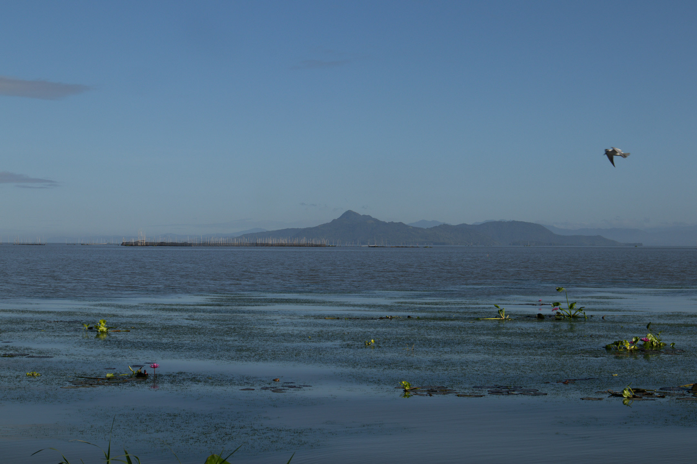

May was surprisingly open. While I did spend more time working for money this month, I had no personal projects (i.e., writing, photography, or walking) scheduled. This gave me more time to think about my free, creative spirituality ([[jiyu shukyo|jiyū shūkyō]]).

I experimented with a couple of things in May. First, me and my partner, Lea, instituted a [[kiitsu kyokai|kiitsu kyōkai]] practice that involved walking to a secluded place in nature, meditating, reading a prompt from the [[calendar of wisdom tolstoy|Calendar of Wisdom]] by [[leo tolstoy|Leo Tolstoy]], free writing about the prompt, and discussing whatever we wrote. I wrote about the practice in my newsletter article [[a sunday walk|"A Sunday Walk"]], which I shared on Facebook. Many friends resonated with the idea that performing a regular spiritual practice with a significant other could be an alternative to attending church, something I wasn't expecting, especially in a very religious Filipino culture.

A second experiment I did this month that worked well was scheduling an hour of meaningful spiritual conversation with a friend. I pitched the idea to this friend, whom I've been conversing with sporadically for the past three years after I felt like a more regular conversation could benefit both of us. After the first session, which was purely a catch-up, we tried doing something similar to what Lea and I did. We meditated, read a prompt, wrote together, and talked freely. I'm learning a lot from my friend and our conversations, and he is enjoying them, too, so we plan to continue with them in the coming weeks.

Around the middle of May, I spent an entire morning translating [[shinichiro imaoka|Shin'ichirō Imaoka's]] [[imaoka principles of living|Principles of Living]], both the 1973 and the 1981 versions. While they're still far from final, the translations helped me understand Imaoka's ideas better in the context of my culture. If you speak Filipino, here they are: [[imaoka mga simulain ko sa pamumuhay|Mga Simulain ko sa Pamumuhay ni Imaoka Shin’ichirō]].

The most significant leap of faith I took this month was finally confronting the idea of [[god|God]] after years of avoiding it. As I explained in my essay [[bathala wala intro|"Bathala Wala" (Part One): Confronting "God" on the Mt. Makiling Trail]], I was moved by my conversation with Lea during our first kiitsu kyōkai walk to rethink my metaphysical beliefs, including my non-belief in God. To examine my reasons for disbelieving in a personal God, I started exploring the works of [[john schellenberg|John Schellenberg]], including his book [[divine hiddenness and human reason schellenberg|Divine Hiddenness and Human Reason]], which introduced the [[hiddenness argument]] of [[atheism]]. I also opened myself up to alternative conceptions of God, such as [[baruch spinoza|Bruch Spinoza's]] [[god or nature|"God or Nature"]], [[wieman minimalist definition of god|Henry Wieman's minimalist definition of God]], [[dewey concept of god|Dewey's concept of God]], and the radical postmodern idea of God as an event by [[john caputo|John D. Caputo]]. In the weeks ahead, I intend to delve deeper into these possibilities, hoping to settle on at least one explanation I am comfortable with.

In other news, I wrote another essay, [[never finished never arrived|"Never Finished, Never Arrived"]], about the importance of journaling in a spiritual life. I was also accepted in my second writer's workshop, which I intend to write about in next month's issue.