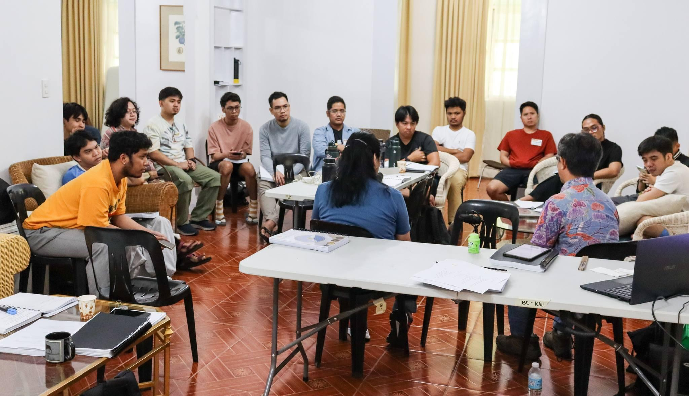
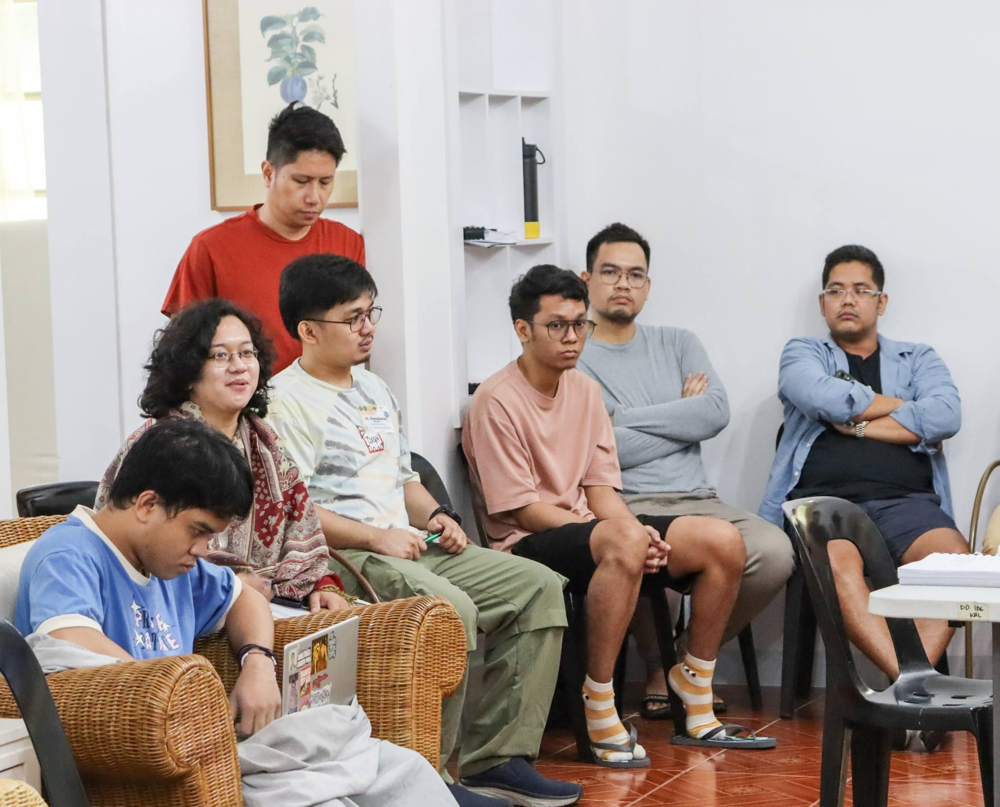
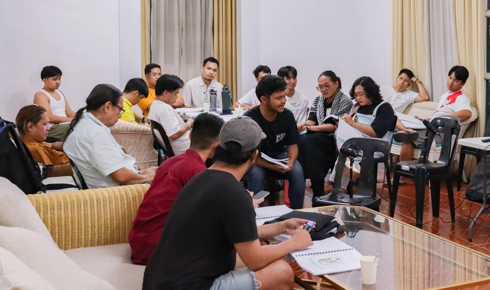
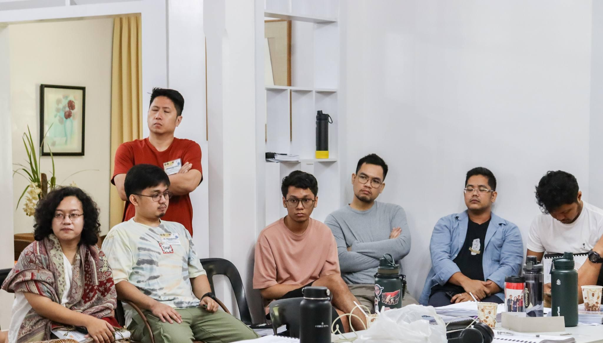

Uman friends,

I almost gave up on writing this issue. The first two weeks of July were synonymous with sickness. It wasn't easy to get anything going. So, rest and more rest was what I did. Alas, things felt a little bit better today, so I opened my laptop and started typing these words.

Here, behold, is a quick roundup of June.

## Palihang Rogelio Sicat 17 (PRS 17)

The highlight of June was the seventeenth iteration of the Palihang Rogelio Sicat (PRS 17), of which I became a fellow for poetry. The Tagalog word "palihan" means anvil and is the Tagalog literati's chosen translation for the English word "workshop." The image is a craftsperson hitting their newly smelted steel on an anvil to shape it into a tool or weapon of choice. Ideally, a writers' workshop functions this way. The newly smelted steel is a draft of a poem, essay, short story, or play. We lay it over the anvil (the palihan), where we fellows, craftspersons that we are, hit it with feedback that, given correctly, hopefully molds the metal into the right shape.

The "right shape" is often tricky because everyone has an opinion on how the piece must be shaped. This is where close reading and listening become essential. Without fellows reading the piece as closely as possible, with every ounce of their empathy, it would be impossible to glimpse the natural shape the piece is trying to take and provide feedback that the writer needs to hear. Likewise, without the writer listening as closely as possible to what the fellows are saying, it is impossible to decipher the piece's most critical loopholes and blind spots.

Workshops are usually scheduled for five days, with three of those days as the core, when pieces are discussed. With PRS 17, we started very early (around 8 in the morning) and ended up until 9 in the evening, with a few hours of rest in between sessions. I've only experienced two writers' workshops so far, but I can't help but notice their similarities with *sesshins* or zen retreats. A *sesshin* also typically last five days, with three of those days as full-day retreats. If writers' workshops have a single core activity, i.e., reading and giving comments to literary works, *sesshins* also revolve around a core activity: sitting silently while counting one's breaths. The length of focused time dedicated to both activities and the repetitions entailed in engaging in them produce effects that aren't often experienced in everyday life. Suddenly, writing (and reading) becomes a lot easier. Suddenly, finding peace of mind becomes more possible, especially during the first few days after a *sesshin*. Even during a writers' workshop or a *sesshin*, brief visions and insights often occur—enough to sustain or inspire one's writing or meditation practice.

For example, PRS 17 was my first immersion in playwriting. While I've written plays as a high school student—an activity I really enjoyed—I've never had experience doing it today as a professional writer. After reading and providing feedback on three plays during the workshop, I found a new interest in plays and the courage to try writing one in the coming weeks. In preparation for this new writing adventure, I watched the one-act play of Jon Santos called ["Bawat Bonggang Bagay,"](https://www.gmanetwork.com/news/lifestyle/artandculture/911165/bawat-bonggang-bagay-a-one-man-play-by-jon-santos-reminds-us-all-the-reasons-to-keep-living/story/) a translation of Duncan MacMillan and Johnny Donahoe's interactive play ["Every Brilliant Thing."](https://www.pcs.org/features/the-story-behind-every-brilliant-thing) I'm also currently reading *[Virgin Po (Muli) Ako](https://unipress.ateneo.edu/product/virgin-muli-po-ako-mga-dulang-may-isang-yugto)* (I'm a Virgin Again) by Reuel Molina Aguila, a beginner's friendly guide (of sorts) to writing one-act plays.

## Obong

The piece that landed me a spot at the PRS 17 was a poem I wrote last year called [[obong|Obong]] or "Nest." The original was written in [[04 notes/pangasinan|Pangasinan]], the language I spoke growing up, but since the workshop was in Filipino, I translated the poem into Filipino. One of the highlights of my PRS 17 experience was [reading the poem](https://www.facebook.com/100003608274029/videos/947001643888046/) in its original in front of my co-fellows before they discussed it. This experience was significant because Pangasinan literature is at a really low point these days, a fact that pierces my conscience as a Pangasinan writer who writes primarily in English. I write a few of my poems in this language and publish them wherever I can to contribute to reviving Pangasinan literature, a task left in the hands of writers whose number could literally be counted by just two hands.

I received helpful feedback from my co-fellows and a panel of seasoned veteran writers. It was also a privilege to have the stanzas of my poem translated into other Filipino languages—the languages of four other co-fellows from different parts of the Philippines—and [performed](https://www.facebook.com/100003608274029/videos/319657124413821/) at the closing ceremony of PRS 17. I'm currently revising the poem based on the feedback I received from the workshop, before I send it to an online publication where it, hopefully, would find a home.

## Reading through Vincenz Serrano's Walking Syllabus

A second highlight of my month was my deepened study of [[04 notes/walking]]. It's a long time coming, but I finally started reading the resources listed in [[vincenz serrano|Vincenz Serrano's]] syllabus of his walking class at the Ateneo de Manila University. I'm doing this in preparation for a few walks I plan to do (as soon as my health gets to a hundred percent). Among these walks is tracing [[teodora alonzo walks|Teodora Alonzo's walk from Calamba to Santa Cruz]]. Teodora Alonzo is the mother of Filipino national hero Jose Rizal. At age 45, she was made to walk some 50 kilometers from their house at Calamba to the nearest provincial jail, where she was incarcerated for a crime she was innocent of. Since I live in Los Baños, halfway through these two locations, I decided to try the walk myself. My reflections on my readings gave birth to some ideas on [[how to walk the philippines|how to walk the Philippines]], ideas that would be critical in writing about future walks, including this Teodora Alonzo walk. In other walking news, the only [[05 obsidian/tags/tlw|TLW]] issue I managed to release in June was entitled "[[the walker who greets another body|The Walker Who Greets Another Body]]."

***

Here ends this short Uman issue. Thank you for reading, and I hope to see you again next month.

