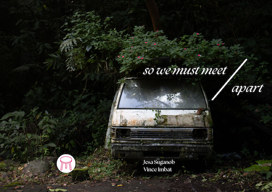
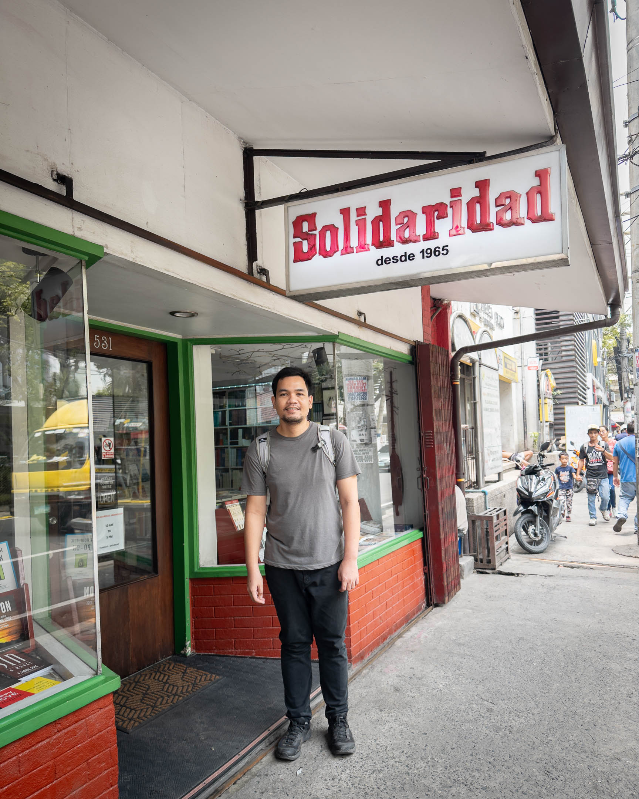
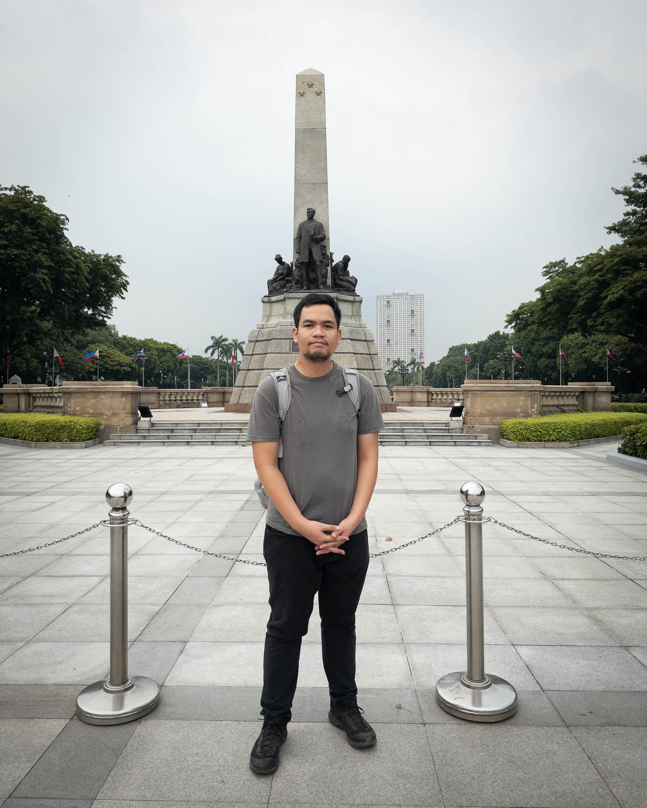
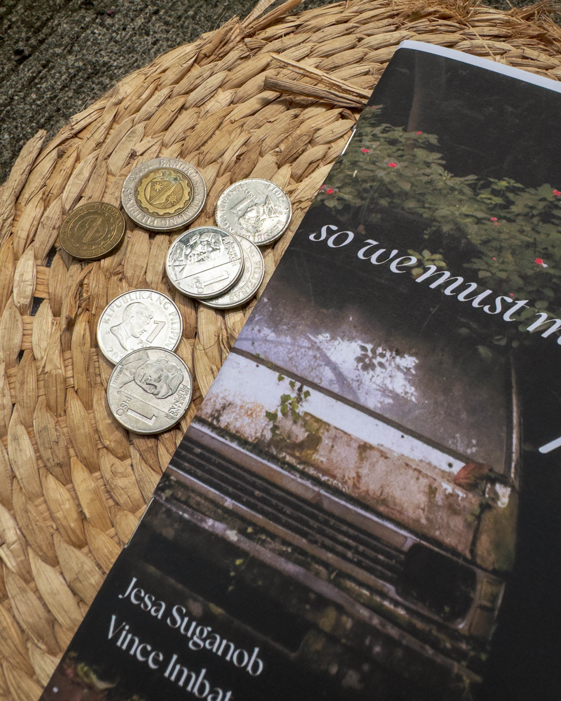

I asked her whether she would accept our invitation to serve as a panelist in what I thought was the first (now I learned it was the second) creative writing workshop in the Pangasinan language. My colleagues highly recommended her.

She declined. She said her handle of the language isn't strong. She writes using how she speaks, using everyday Pangasinan, which seems different from the literary pieces she reads written in the language. She said she may have won the contest because she wrote with her heart. She said, she doesn't yet have what it takes to be a panelist and would rather be a participant.

I thanked her for her response and told her I respected her decision. However, I also shared that I felt the same way and that I'm a firm advocate of the way of writing she described. I told her that the workshop would be launched in 2025 and that she should feel free to contact me if she ever changed her mind.

***

Hello reader,

In case you've forgotten, this is Uman (or Change), a monthly newsletter on spirituality, walking, writing, and photography. And I'm Vince, a Pangasinense writer trying to weave all these together into a life.

***

## Pangasinan, Literature, and Nation

In July, I went home to Pangasinan (again) for about a week to attend the one-day conference "Pangasinan, Literature, and Nation" organized by Panpacific University, Urdaneta City, in collaboration with PEN Philippines. The conference featured two panel discussions (one in the morning and another in the afternoon) tackling Pangasinan's current state of literature. To provide a summary of what that state looks like, here's an excerpt with a proposal I've been working on recently:

>While the Pangasinan province's more than three million residents represent nearly two-thirds of the total population of Region I and nearly 3 percent of the population of the Philippines, its indigenous language, particularly in its written form, is continuously diminishing in use.
>
>While spoken Pangasinan is enjoying a revitalization through the rise of social media influencers who use the language in their reels, videos, and posts, the production of works in written Pangasinan, particularly literary pieces, has been meager since the 1960s. There is a glaring dearth of written works in the Pangasinan language, which is explained by the lack of writers writing in the language. As Melchor E. Orpilla, the current commissioner of the Pangasinan language in the Komisyon ng Wikang Filipino (KWF), alluded to in the July 2024 event "Pangasinan, Literature, and Nation" held at Urdaneta City, the number of writers in the Pangasinan language can only be counted in both hands. Furthermore, even if there are contemporary writers in the language, there is no assurance that a new-wave literary movement composed of a younger generation of writers would arise.

Two years ago, I wasn't part of that number of Pangasinan writers countable only with two hands. But with writers getting old and some dying, I find myself getting closer and closer to the fold.

***

During the event, I met some of my Pangasinan writing colleagues in person for the first time. They found me online when my poem ["Gawat"](https://tldtd.org/poet/vince-imbat/) was published by TLDTD.org in 2022, and we have connected ever since. But it wasn't until July 2024 that we saw each other in person. Through several minutes of conversation with them during break sessions in the event, I was inspired to deepen my commitment to supporting the Pangasinan writing community's initiatives. After the event, I shared several video clips on social media, stirring honest public conversations about the state of writing in the language. One of the [videos](https://www.facebook.com/100003608274029/videos/377115671679227/) was widely shared, triggering difficult but necessary conversations about inclusion and exclusion in Pangasinan literature. These were conversations I once only had in my head. Now everyone is talking about them.

My increased involvement within the Pangasinan writing community this month peaked when I submitted a proposal for the creation of a Pangasinan writers group within the lone Pangasinan cultural and literary group based in the province, the Ulopan na Pansiyansiya'y Salitan Pangasinan (UPSP). I'm also drafting a proposal that, once approved, would receive funding for the ~~first~~ second writers workshop purely in the Pangasinan language.

The biggest challenge so far in writing the latter proposal is finding writers willing to be panelists in the workshop. Pangasinan writers are so few and many are still young in their literary use of the language (including myself) that some feel inadequate and unqualified. But a language with almost no writers shouldn't be expected to yield literary gods who are already credentialed, workshopped, and institutionalized. This expectation is impossible to meet at this point. A language like Pangasinan, which has such a weak literary production, should be forgiving of its current "experts." Writers working in the language should forgive themselves for their inadequacies and step up despite their lack of qualifications. They are qualified because they have the courage to write in a language where almost no one is reading. The mere fact that their peers recommend them is enough credential.

***

En route back home to Los Baños, I stayed around Manila for a couple of days. I visited the large Fully Booked branch at SM Mall of Asia and the La Solidaridad Bookshop, founded by F. Sionil Jose, the Filipino National Artist and one of Pangasinan's preeminent and prolific writers. I'm a bit ashamed to admit that it was also my first time visiting Luneta Park, the place where Jose Rizal and the three martyr priests were executed.

***
## So We Must Meet Apart

This July, my friend Jesa Suganob and I launched a zine called "So We Must Meet Apart." It's my first zine and collaboration with a fellow writer whose work I deeply respect and admire.

"So We Must Meet Apart" was an experimental project that used walking as a method and platform for writing epistolary essays. The process was simple: Jesa walked around Cagayan de Oro City while I walked around Los Baños. During or after each walk, we wrote letters to each other. We sent and read them only after the experiment ended, and then we processed everything through a written dialogue that became an afterword.

The experiment was surprisingly demanding. The letters explored diverse subjects—body, gender, religion, mental health, grief, poetry—and bordered on confessions. Around this time, I was reading Jhoanna Lynn Cruz's book [[abi nako cruz|Abi Nako]], which challenged me to reveal things I hadn't before.

We've already sold several digital and physical copies of the zine. If you are interested in getting a digital copy of the zine but your are outside the Philippines, [please check this link to buy a copy](https://vinceimbat.gumroad.com/l/apart).

***

Working on the physical production of the zine gave me a first-hand experience of what it means to be a cultural worker and seize my work's means of production. After spending an entire day producing the second batch of "So We Must Meet Apart"—scouting for a better paper, having the copies printed, negotiating to keep the price of printing as low as possible, binding the zines myself by drilling holes in their spines and manually inserting staples in them (because a stapler wasn't available at the printer), and shipping some myself—questions about the flow of money in an endeavor such as zine-making scampered around my head.

How can we keep the price of production low and, therefore, the zine cost low without compromising the project's aesthetic objectives? Is raising the quality of materials used in producing it against the tradition of zine-making? If I use thicker paper or more durable ink, is my zine bourgeois?

Since this is collaborative work, how do we share earnings? Who will spend on production? Who will receive payments? What will happen with earnings? Will it return to production?

While thinking about these questions, someone called outside our door. I looked outside the window and saw a man about my age with a bag on his back and two pieces of small paper in his hands. I went down to talk to him.

His name was Jayson. When I asked him what he needed, he couldn't look at me directly. He apologized for disturbing us and then expressed his purpose for calling. He said that he intended to visit the Mormon missionaries who live in the apartment unit next to us because they visit him at the house he is renting with his family nearby. However, the missionaries were not around, so he took the courage to call on our door.

He said her mom has been suffering from kidney failure, and irregular dialysis has caused toxins to reach her lungs. He said that help from the government arrives so slow and isn't enough. He doesn't have a job, so going around and asking for help is what he can only do to help her mom. I asked him how old she was. He said she was 44.

I went back upstairs to get some money to give to Jayson. When I handed it to him, Jayson went near, so I held his shoulders with my arms and told him to take care on his way home. I expressed hope that her mother gets the dialysis she needs.

When I returned upstairs, I lay on my bed staring at the ceiling. I remembered my mom who is turning sixty in a couple of years. That was when I realized I may have given all the profits I could make from the batch of the zines I printed.

