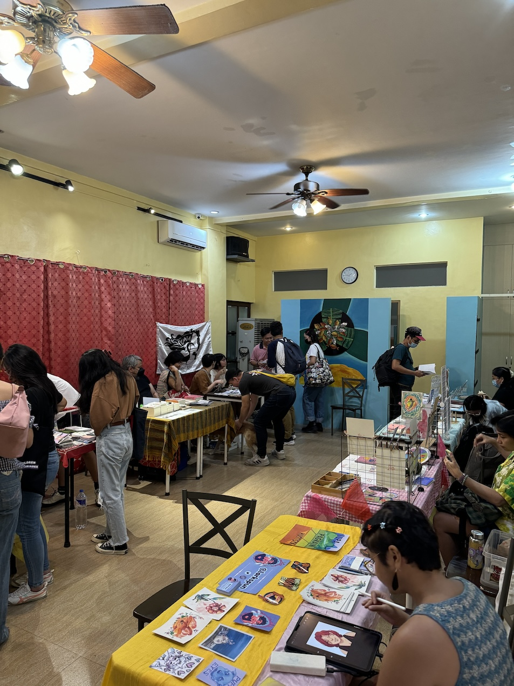
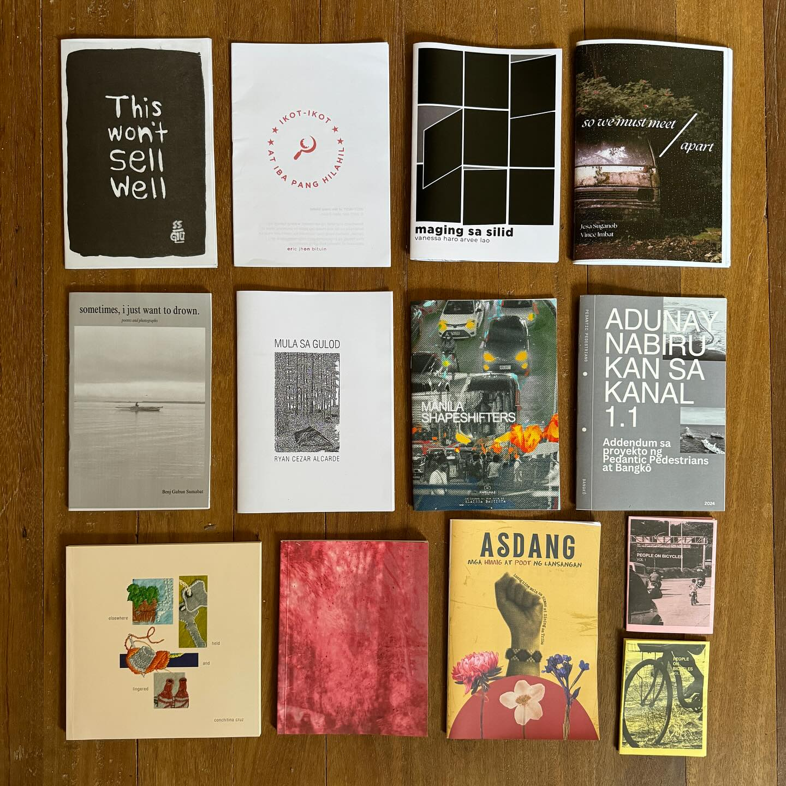
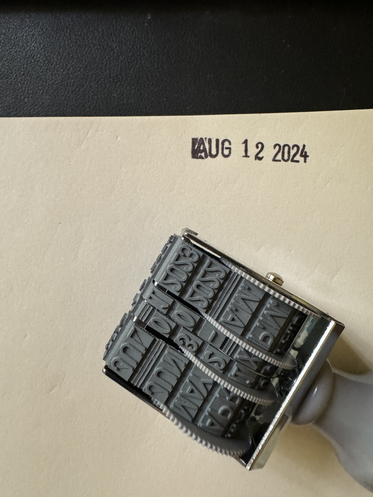
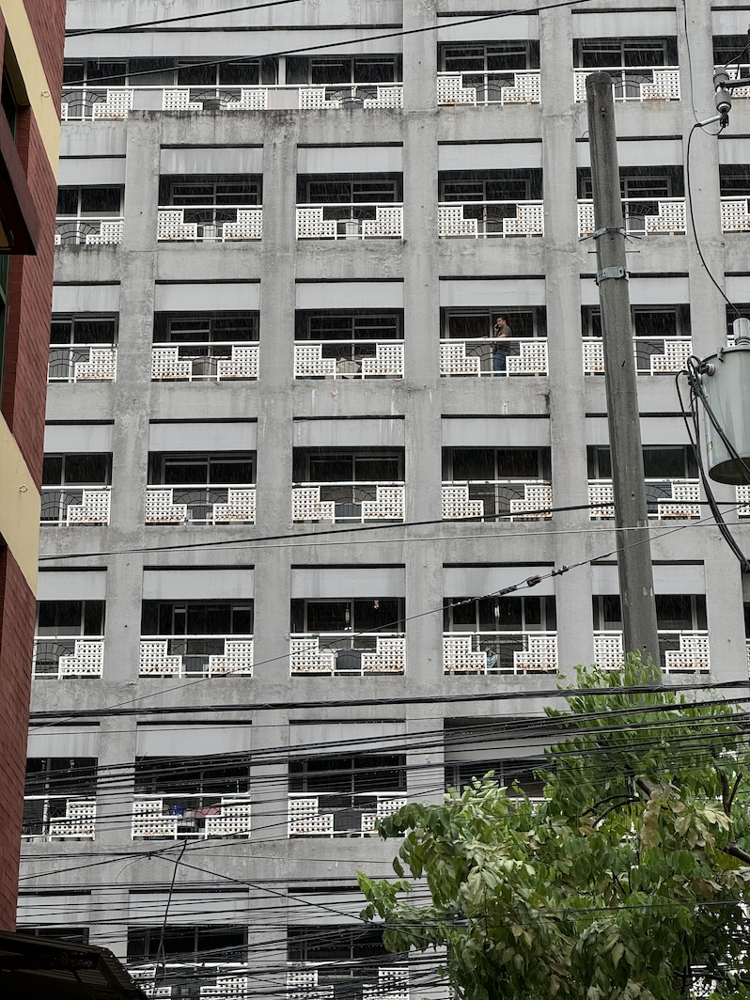

I'm [Vince Imbat](/), and this is [Uman](uman), a collage of updates on projects and studies from the previous month I send to dear friends and readers every month. This is its August 2024 edition.

## BLTX

BLTX, short for "Better Living Through Xeroxography," is a gathering of zinesters, independent publishers, and small presses, where new and old zines, books, and merchandise are sold directly by writers and artists to readers. The first BLTX was organized a few months after [[adam david]] published his manifesto entitled ["Better Living Through Xeroxography: Literary Patricide by Way of the Small Independent Press"](https://wasaaak.blogspot.com/2009/04/better-living-through-xeroxography.html) on April 2, 2009. After explaining how the Philippine mainstream publishing industry gatekeeps the emergence of new voices in writing and kills experimentation in new forms of writing lives in the name of profit and preserving the status quo, Adam's call to arms in his manifesto came as follows:

>What we should be focussing on is creating and providing new venues for alternative attitudes in Reading and Writing, creating and providing new venues for ourselves and our "unmarketable" material, for our "unrefereed" efforts. What we should be focussing on is developing and cultivating an audience that will read and understand and actively seek our work. We should stop writing down to Mainstream Publishers' standards of marketability and literariness and start writing up to raising the quality of available reading material, and the only way to do those things and remain untarnished--remain honest to ourselves and to our art--is to do the publishing ourselves.

The first BLTX expo, conceptualized and organized by [The Youth and Beauty Brigade](https://www.facebook.com/profile.php?id=100067329506120), was held the following year on 3 December 2010 at a videoke bar called Ilyong's at Kalantiaw, Project Four, Quezon City. Since then, BLTX has grown significantly, sparking the creation of small presses and independent publishers. These entities have since co-organized and supported the expo, which is held multiple times a year in different parts of the Philippines.

I'm a latecomer to BLTX (well, to literary life in general). My first exposure to it was from a friend who runs a small independent press. But I never gave much attention to BLTX during those few years I've known this friend. What got me thinking about BLTX and the principles that gave rise to it was reading Conchitina Cruz's dissertation [[authoring autonomy cruz|"Authoring Autonomy: The Politics of Art for Art's Sake in Filipino Poetry in English"]], which I read while writing an essay late last year. [[conchitina cruz]], or Chingbee, is Adam's wife. In the last chapter of her dissertation, entitled "The Filipino Author as Producer," Cruz explains why she continues to self-publish her works despite working in the academe, where publishing opportunities abound.

>My employment as a teacher of creative writing in a university converts my work in poetry into salaried work. The pursuit of tenure obligates me to produce poetry along a path apart from Lacaba‘s "Kagila-gilalas" or Tariman‘s work: the anonymity to which their poetry aspires is the fate my poetry ought to evade. It is in my interest as an academic for writing to become a precious commodity produced by the specialist. In the academy, a branch of the professionalized literary world, my signature is a necessity whose value should increase over time. This trains me to invest my work in pursuits compatible with the industries and institutions whose recognition of my byline invests it with value.

She continues...

>Because I have, for good or ill, decided to remain a practitioner in the professionalized world of writing, I am perpetually troubled by my complicity in the recognizably unjust mechanisms that govern it. What options for resistance are imaginable for the poet as academic, whose career requires deference to existing structures that poetry itself supposedly, at least symbolically, resists?

And finally...

>In other words, I cannot reject the status quo simply by writing poetry. To propose an alternative _attitude_ necessitates an alternative _position_ in relations of production, a distinction which has changed my attitude toward the publication and circulation of my work.

What position did she choose to take?

>I have, however, since then, published books and zines of my work (including _There Is No Emergency_) independently, through the DIY efforts of local small presses which I help finance and run. These works are neither eligible for awards, whose rules for participation require the resources of bigger publishers, nor visible in National Book Store, whose shelves are reserved for Anvil Publishing and other publishers that can afford its shelf space.

Reading Cruz's thesis and encountering BLTX is one of the many growing-up moments I had as a writer in the last two years I've intentionally chosen a life in letters. These encounters continue to challenge my own poetics and relationship to the mode of production of my own writing, which heavily leans toward the use of journal entries, drafts, and this website, a digital garden I call [[talahardin]], which is by itself an archive, an unfinished work incapable of being produced through traditional means of mainstream publishing.

Of course, I went to my first BLTX at Sikat Studio, Tomas Morato, Quezon City, this August. I was compelled to go because I assisted my friends in releasing a zine I co-authored with [[jesa suganob]], a collection of epistolary essays on walking called *[[so we must meet apart]]*. I was reunited with several friends at the event, including co-fellows from the two national writing workshops I've attended. I also took home a handful of zines, most of which I consumed throughout August. The best thing that came out of the experience, however, is my realization that the self-publishing model is actually the best model for producing work in the Pangasinan language, where there are very few audiences. As I wrote in my short essay "[[muli-muliy panself-publish ed pangasinan]]," a small audience necessitates the production of works in small quantities. This model also encourages writers to publish their works because of its relative ease. Since a lack of literary output is a primary reason why Pangasinan literature has been at its low for almost a century, self-publishing through small presses, I think, is the way to go.

## A Walking Poetics

Aside from thoughts on self-publication, BLTX triggered more thinking about my poetics as a writer. I admire the self-reflection of Cruz, David, and the many other writers supporting the movement, and I am encouraged to look at my own position and my own principles of writing.

This August, I took some time to revise [[my poetics]], a work-in-progress document that, like most of the things I'm writing these days, is currently fragmented and unfinished. But I'm sharing it here anyway because this is my poetics: a walking poetics that leans toward the unfinished, the meandering, and the fragmentary.

While thinking about my poetics, I couldn't help but think about my overall writing life. I bought a date stamp and added this as part of my daily journaling practice. I was surprised how something as little as stamping the date on the page encourages me to write and show up every day on the blank page. I also moved my office to a smaller but quieter room in my apartment and added a whiteboard and a bookshelf. I also bought my very first printer as I intend to read drafts of my works in printed form as part of my revision process, which I've omitted for years.

If much of the writing life is defined by the material circumstances that make literary production possible, then perhaps little tweaks like this in a writer's material environment have some effects. We'll see if I'm right in the months ahead.

## Photography and Psychogeography

After BLTX, I continued studying the walking literature. I'm currently going through each reference in [[vincenz serrano|Vincenz Serrano's]] syllabus for his walking class at the Ateneo de Manila University. My reading this month centered on [[theory of the derive debord|Theory of the Derive]] by Guy Debord and [[why observing matters nightingale|Why Observing Matters]] by Virginia Nightingale.

It was in the middle of my reading when my friend and mentor [[louise far]] encouraged me to send an application to the 2025 Angkor Photo Workshops to be held in Siem Reap, Cambodia, early next year. I only had a few days before the deadline, so I used what I already had. I sent a collection of photos I took during the [[tall tales 1|Baguio walk]] I did last January 2024, when I revisited several routes I used to walk on as a minister of the Jehovah's Witnesses more than a decade ago. I then attempted to write a proposal.

I knew if I proposed any photographic project, it would involve walking. My previous walks, however, were text-heavy and not really photographic projects per se. Somehow, as I look back at those walking projects, my intention to produce words got in the way of producing a more cohesive photographic part of the project. My photos were secondary to the text. In short, I've never really had a photo-first project. How could I design a photo project involving walking in Siem Reap?

I returned to what I already knew. I returned to my earlier readings on walking and sought to integrate them into my proposal. I decided to propose a psychogeographic walking photo project set in Siem Reap. In simple terms, [[psychogeography 1]] is a field of study that took off after the Second World War at the center of which is an inquiry on how places make us feel and why. The [[derive]], a methodological walk, is the primary tool of psychogeography. Luckily, I found a couple of recent studies that applied psychogeography to photography: [[photographing loneliness wang|Photographing Loneliness]] by Yitong Wang and [[psychogeography and photography arnold|Psychogeography and Photography]] by Emma Arnold. These two readings made me realize how photographers have applied psychogeography in recent years and what sort of projects could be designed by combining these two. I don't expect to get in the workshop. But writing that application helped me return to thinking about my photographic practice, something I have again neglected in recent months, and how it relates to my walking practice.

## A Hundred Different Ways to Walk in Pangasinan

These days, I'm working on an essay about walking in Pangasinan, the province where I grew up. I intend to do at least one week-long walk of the province before the year ends, but I want to do it with a clear framework. So, this essay is an attempt to find that framework.

My essay revolves around this question: "How should I walk Pangasinan?"

To play with the question, I started listing different walks in the province I've done in the past and sketched vignettes about each walk. There is a vignette about the first walk I did as a child based on accounts from my parents. There is also a vignette about my very first funeral procession.

Since I was writing the essay in Pangasinan, I looked for specific words to name the kind of walks my vignettes were trying to encapsulate. I was stuck finding a Pangasinan word for a child's first walk. In English, there's "toddle." In Filipino, there's *ampang*. There has to be a word in Pangasinan. I used the [[cosgaya dictionary]], a Pangasinan dictionary written in Spanish and the oldest dictionary available. It is a scanned PDF that is downloadable from the internet. To look for the Pangasinan word for toddle, I decided to search for the occurrence of the Spanish word *niño* (or child) throughout the dictionary. I looked at each occurrence until I found what I was looking for. There are two Pangasinan words for a child's first walk: ampang or tayakdang.

Finding these two words gave me an idea: I would look for all the occurrences of the Spanish words *caminar* and *andar*, two words used to refer to walking, throughout the Cosgaya Dictionary to find whether there are other forms of walking in the Pangasinan vocabulary. The search, which took two days of my time, revealed over a hundred words describing distinct and specific forms of walking. 

There are lots of words describing how a drunk walks: *dangaldangal*, *diwetdiwet*, *dompalit*, *dungey*, *dungil*, *tingaytingay*, and *waralwaral*. Several words also refer to how the sick or old walks: *dapilos*, *kapakapa*, *patilpatil*, *kitakit*, and *kitday*. But what I was really amazed about was finding words that refer to very specific kinds of walking—walks that one won't even care to name these days. For example, the Pangasinan language has a word for walking sideways like a crab (*damimi*), walking with wide steps then stopping as if to bow (*indo-indok*), and walking together as a group while holding each other's hands (*tambing*). Why we had all these words about walking in the past and why we no longer use them today is a question I would like to find answers to in the coming months.

I plan on publishing the essay as my first zine in the Pangasinan language this year or the next.

