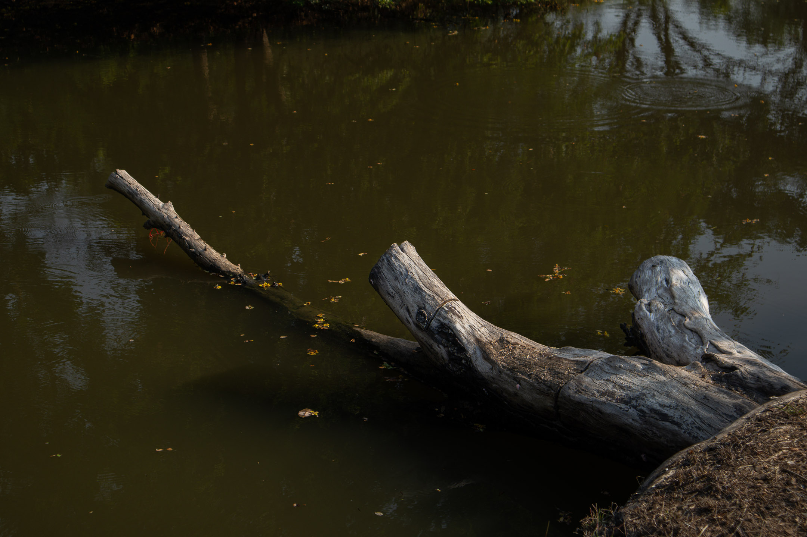
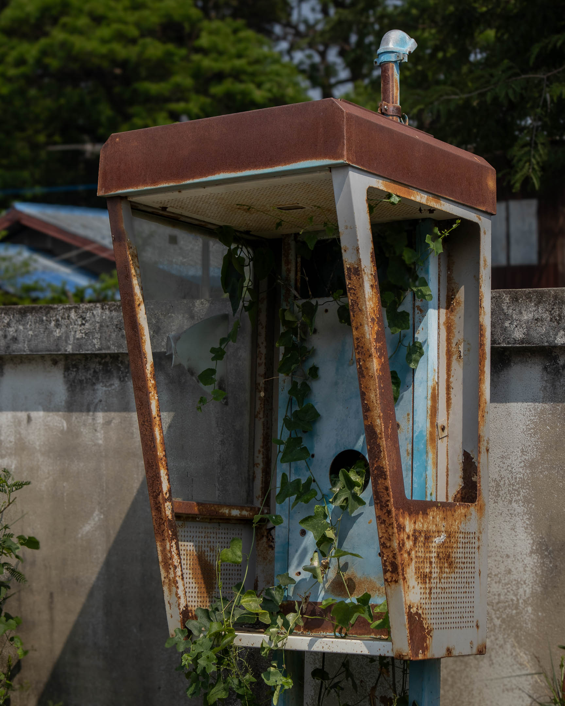
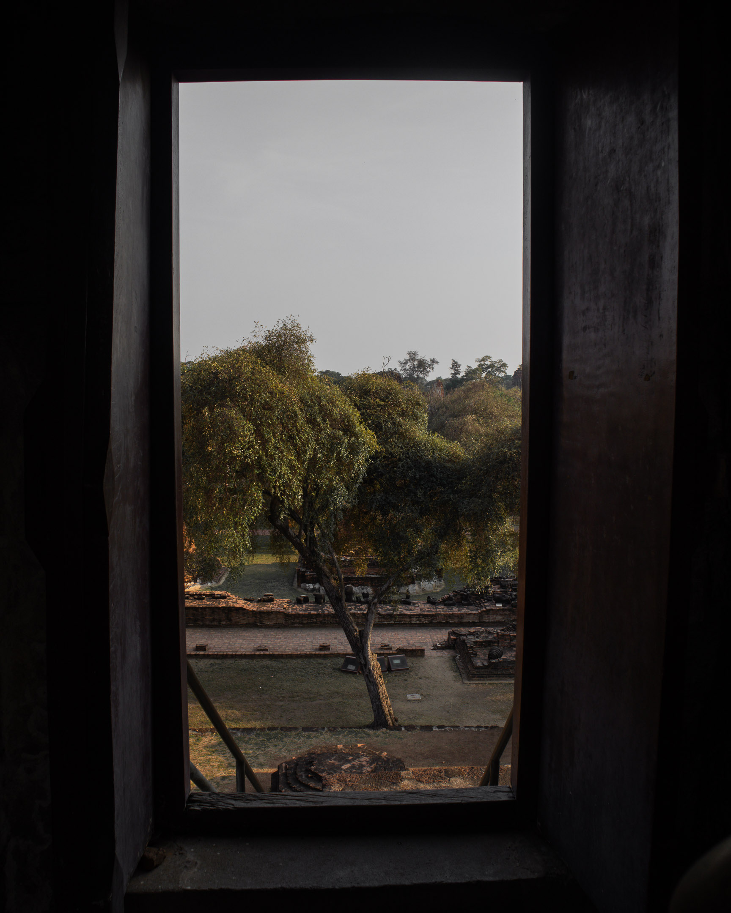

The power to re-imagine the world, to bring out alternatives, possibilities, and visions—this is what poetry and art are about. And so, an art practice treated as a religious discipline is my direction. While I shall attempt to create a sincere and honest account of my life, my writing always ought to recognize or even put at the center my relationship to the whole. The way of writing and all decisions related to this (how my work sounds, looks, feels) will always contend with structures that put me in constant conversation with the whole. What literary traditions and forms should I explore and use in my works? How can my choice of form reflect my spiritual, philosophical stance? I want the process of writing, creativity, and sharing the artifact of my creativity to be a way for me to truly be near others. I want to get closer to the natural world, society, people, and the universe during the act of writing. I want to think about my reader when I write. Writing and the network of activities surrounding it are my religion.

I think a healthy religious position is one where I recognize the differences among cultures and the uniqueness of individuals, but despite that, I trust in an underlying unity that could make communication, peace, and love possible. When the first is lost, religion becomes a tool for oppression, where a dominant culture or belief system is imposed on others and many people. When the second is lost, religion reinforces division and accelerates forgetting—forgetting that before anything else, we are humans and citizens of nature, we were thrown in the Universe outside of our volition, and that we all decay and die, and that these and more unites us—again, outside of our control.

But for me, I really want to go deep into writing words that are a balm to others. And there is so much I need to learn to do this. So much I need to do to hear myself. Given that writing is inward, how can it be truly a force of love and cohesion, and growth in mutuality? How can I be religious as a writer, binding myself to others, to a way of life that maintains my interconnection with others?

Transcendence: (n.) to feel deeply motivated to be a force for others.

How do I orient my life based on the understanding that there is something beyond me? Sometimes (and more often than I sometimes care to admit), I find it helpful to personify such an idea. I do feel such a need, and I continue to think that an appropriate, poetic, supreme fiction, when knowingly understood as fictive, but nevertheless wilfully believed in or contemplated, can usefully help me.

Of all reinterpretations of God, I think Wieman's, which somehow is also related to Dewey's, is the closest to what I've chosen to do with my life—ART. The primary motivation for art is the growth of meaning—a practice that could replace traditional religious discipline today. Since my religion needs an object of devotion, I could call—as Wieman did—this endless possibility of growth in meaning and mutuality as, in fact, God. The primary motivation for participating in the world of culture in the first place is this: to make the world larger.

It just dawned on me that the Wiemans' theology and my articulation of the world where I walk work together. Here it goes.

Given my realization of my thrownness, I could either kill myself or respond to this in pain OR befriend the universe. IT IS A CHOICE. Choosing to befriend the universe is a jump to meaning and its growth. One just fills one's life with pathos until one dies. And then, this pursuit of meaning and pathos could be seen and designed as a religious discipline of imaginative contemplation. Imaginative contemplation, because it is only through the development of our poetic faculties that we can imagine possibilities that will spur us to change. And we need this in our act of befriending this universe because inevitably, befriending will lead us to others, both human and non-human. None of the artists that came before us _had_ to make what they made, and they made them in times when terrible things also occurred. And, many years later, we turn to them to remember ourselves.

Every execution of my creative practice is an act of devotion. No matter how seemingly personal or individual this is, it really is orienting my life toward that source of eternal meaning. And this largeness and growth achieved by an art practice could also be used to grow mutuality and love among people. This is how I need to see writing and art—a conscious act of befriending the universe, of entering the world of meaning, a settling, and then walking out of my comfort zone to transcend myself and connect with others in a continuous process of back and forth until re-imagination spurs change. The Unmoved Mover, housed at the center of the Universe, is an indoor God who is going nowhere. But the Creator God walks in the garden in the cool of the day precisely because no Universe and no building contain it. My God is the walk and what can be learned on the walk—that which brings people together, that which expands the world ever-so-slightly more, making us feel so ever-so-slightly smaller within it all.

If ever I arrive at the idea of God I'm comfortable with, which as it currently is I'm felling I'm arriving into it if I've not yet arrived, then it makes a lot of sense to put this central into my life—in a way (even as I'm writing this now), I'm feeling that I'm embodying my religion. If God is Nature and the process that makes it what it is (natura naturans), then a natural religion is one that aligns one's life with this process. I can never lose a genuine religion. Once it is genuine, I can never lose it. Because it is me, it is a way of life, it changes as I change, never ends and never arrives.

But we don't always act based on reason. We don't always deliberate. It is the moment and our unspoken relationship to it—our feelings about it—that make us decisive. A compromise: an agreement that aligning myself to the whole and its growth might be the supreme value. But my daily choices won't always necessarily reflect this, given the constraint of the moment (the here and now). And that is why religiosity is intentional and requires hard work. But also surrender. Sometimes, I just have to surrender to what the moment asks and trust that the supreme thing will eventually prevail.

This image of the window at Sta. Maria and the image of this window here at LB. And the shadow of the trees. And I talking to that God, perhaps the closest thing ever. It is all coming back now and making me realize how complex I've made my life.
  
"Not my will but Thine be done."

# Notes

- "Sometimes (and more often than I sometimes care to admit)..." is a slightly edited clipping from Andrew James Brown's sermon [“Maternalisation Is Materialisation."](https://andrewjbrown.blogspot.com/2025/03/maternalisation-is-materialisationa.html)
- "The primary motivation for participating in the world of culture" comes from Jonathan Lethem's essay [“The Ecstasy of Influence.”](https://harpers.org/archive/2007/02/the-ecstasy-of-influence/)
- "None of the artists..." was taken from  Pádraig Ó Tuama's newsletter article [“Spring Springs.”](https://poetryunbound.substack.com/p/spring-springs)
- "The Unmoved Mover housed at the center of the Universe..." was stolen from Paul Axton's essay ["Why Walking Theology."](https://forgingploughshares.org/2018/08/02/why-walking-theology/)
- "My God is the walk..." is Craig Mod talking in [“Talking While Walking the Camino Francés in Spain.”]((https://craigmod.com/ridgeline/205/)